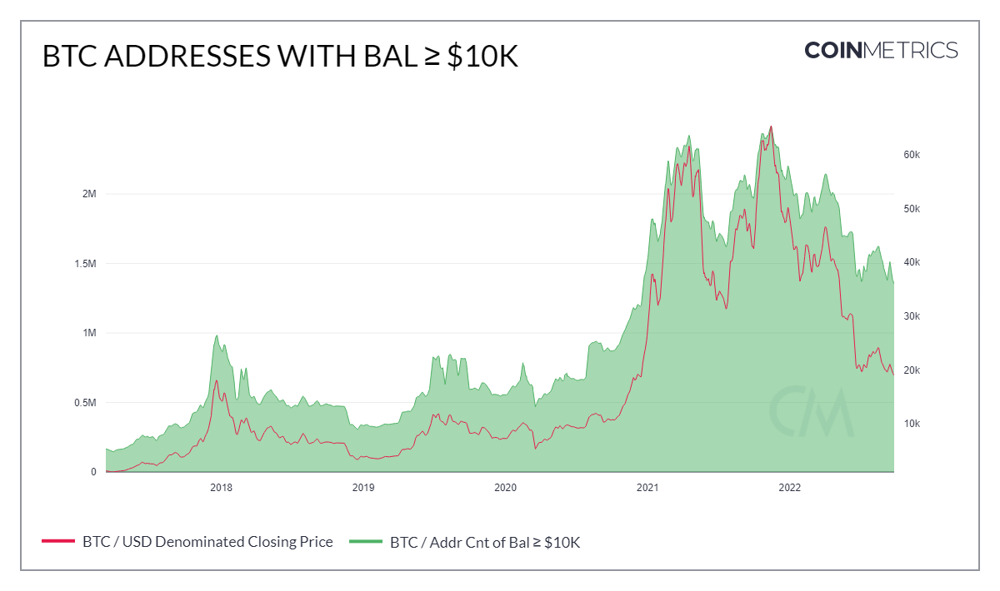

# Addr Cnt of Bal ≥ $10K

The sum count of unique addresses holding at least $10K as of the end of that day. Only native units are considered (e.g., an address with less than $10K but with more than $10K in ERC-20 tokens would not be considered).

| Name                   | MetricID        | Category  | Subcategory | Type | Unit      | Interval |
| ---------------------- | --------------- | --------- | ----------- | ---- | --------- | -------- |
| Addr Cnt of Bal ≥ $10K | AdrBalUSD10KCnt | Addresses | Balance     | Sum  | Addresses | 1 day    |

## Chart

<figure><figcaption></figcaption></figure>

## Examples

* This metric can be used to analyze retail activity and adoption growth.

## Availability for Assets


