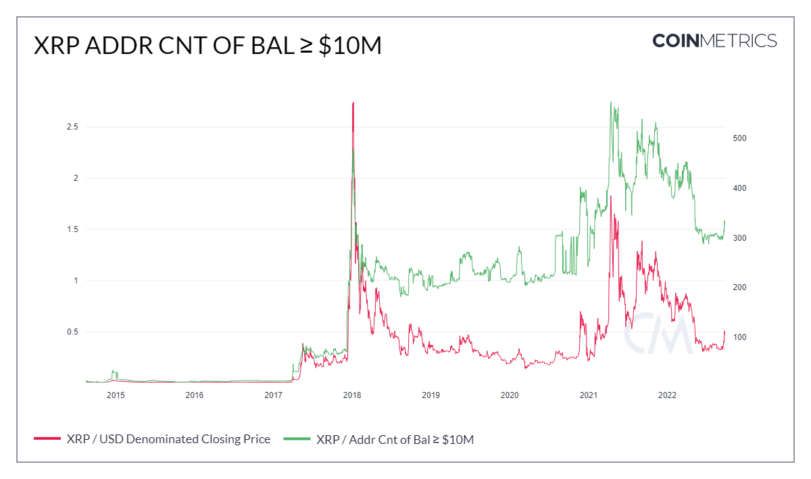

# Addr Cnt of Bal ≥ $10M

The sum count of unique addresses holding at least $10M as of the end of that day. Only native units are considered (e.g., an address with less than $10M but with more than $10M in ERC-20 tokens would not be considered).

| Name                   | MetricID        | Category  | Subcategory | Type | Unit      | Interval |
| ---------------------- | --------------- | --------- | ----------- | ---- | --------- | -------- |
| Addr Cnt of Bal ≥ $10M | AdrBalUSD10MCnt | Addresses | Balance     | Sum  | Addresses | 1 day    |

## Chart

<figure><figcaption></figcaption></figure>

## Examples

* This metric can be used to analyze whale activity. As you can see in the chart above, the price of XRP moves in lockstep with the number of addresses holding balances greater or equal to $10 million USD.

## Availability for Assets


