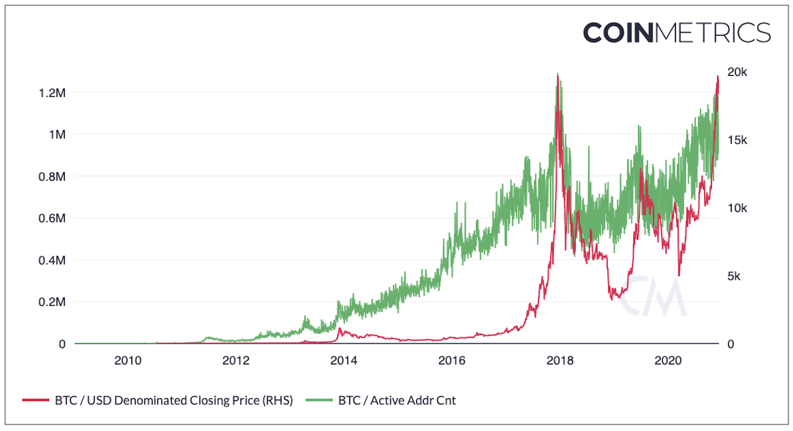

# Active Addr Cnt

## **Definition**

The sum count of unique addresses that were active in the network \(either as a destination or source of a ledger change\) that day. All parties in a ledger change action \(source and destination\) are counted. Individual addresses are not double-counted if previously active.

## **Dictionary**

| Name | **MetricID** | **Category** | **Sub-category** | **Type** | **Unit** | **Interval** |
| :--- | :--- | :--- | :--- | :--- | :--- | :--- |
| Active Addresses | AdrActCnt | Addresses | Activity | Sum | Addresses | 1 day |

## **Details**

* Active [addresses](../../on-chain-basics.md#address) count the number of unique addresses that participated in a ledger change.
* For this unadjusted version of the metric, all ledger changes are considered.
* Ledger changes can include activities such as transacting, signing of blocks, claiming of mining or staking rewards, voting, creating accounts, and more dependent on whether the underlying protocol supports the activity \(different protocols vary in the types of activities that are supported\).
* All participants of a ledger change activity are included.
* If an address was active multiple times during the aggregation interval \(e.g., 1 day\), it is counted only once.
* For ETH, miners receiving fees from the original sender of a failed transaction are counted as active \(receiving\) addresses.
* Any address that's active \(even if sending 0 ETH, or sending ETH to itself, or involved in failed transactions\) is counted towards active addresses.

## **Chart**

## **Asset-Specific Details**

This metric is not available for assets that have full privacy, like Monero and Grin. For assets that have opt-in privacy features, like ZCash, it only takes the non-private activities into account.

## **Examples**

In a given day:

* Address A mines 10 coins
* Address B sends 2 coins to each C and D
* Address D delegates 20 coins to E
* Address A burns 1 coin
* Address F votes on a protocol change

We would count as active: A, B, C, D, E and F. The value of the metric would therefore be 6.

## **Release History**

* Release Version: 1.0 \(X, 2019\)

## **Interpretation**

Active addresses is a popular measure to proxy the number of users on a blockchain, since it is typically less sensitive to stress-tests \(which often focus on transaction count\). However, active addresses inherit idiosyncrasies from the structure of the particular blockchain, and care must be taken to understand structural differences in active address counts. In blockchains where address creation is cheap or free, and transacting is cheap or free, active addresses can still be trivially forged.

## **See Also**

* [Address](../../on-chain-basics.md#address)
* [Active Addresses \(Received\)](adractreccnt.md)
* [Active Addresses \(Sent\)](adractsentcnt.md)

## Availability for Assets



