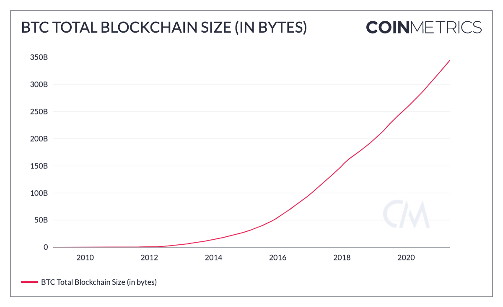
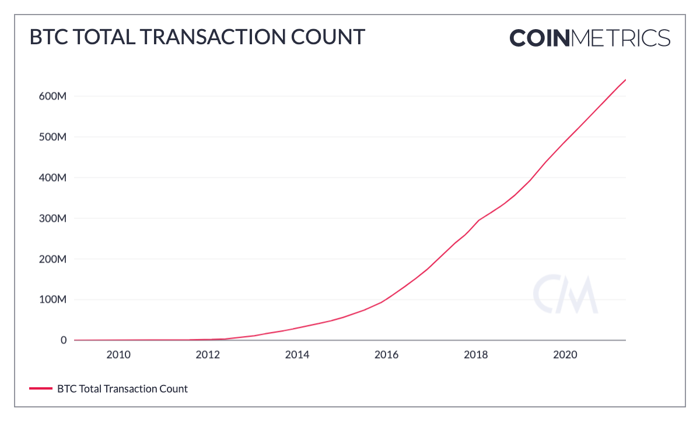
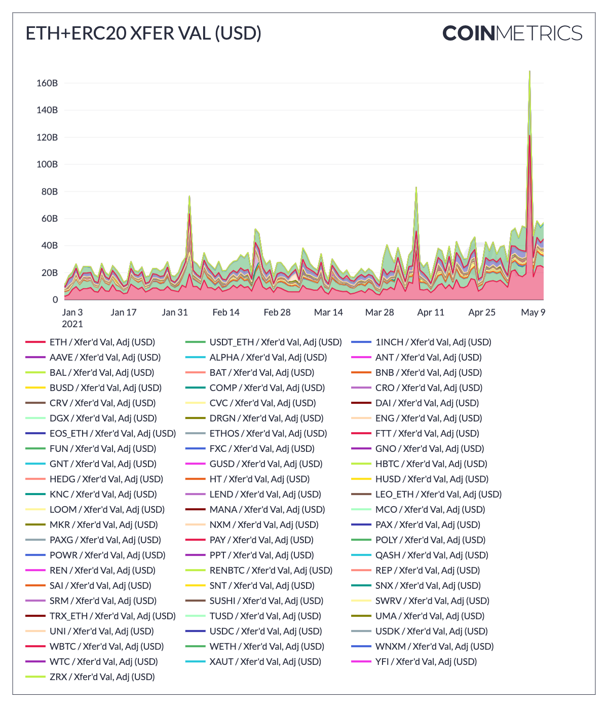

# Asset Metrics FAQs

#### **How can I tell what assets/metrics/frequencies are supported with my Pro Key?**

Refer to our [Network Data Coverage Tool](https://coinmetrics.io/tools/) to find out what is supported with your Pro Key. Simply add your API Key and click “Authenticate” for access. This tool will show you what assets/metrics are supported for both EOD and Real time.

#### **Why don’t you have Coinbase deposits/withdrawals \(on-chain flows\) supply data?**

We don't have on-chain metrics for Coinbase addresses because they don't reuse addresses. At this time, no data providers can get an accurate measurement on their on-chain activity. 

That said, we do offer full market data coverage for Coinbase through our Market Data Feed if you would like visibility into their trading volume.

#### **Do your aggregate exchange deposit/withdrawal and supply \(on-chain flows\) metrics include any Coinbase flows?**

Our aggregate on-chain exchange metrics \(eg. FlowOutExInclUSD or FlowOutExInclUSD\) do include some Coinbase cold storage addresses. However, relative to the inputs from other constituent exchanges the the impact on the total aggregate flows is minimal. 

#### **Why is your Current Supply \(SplyCur\) of XLM different from the supply reported on Stellar’s Dashboard? \(**[**https://dashboard.stellar.org**](https://dashboard.stellar.org)**\)**

This difference is due to how we treat the 55 billion tokens that the Stellar Development Foundation “burned”, or more accurately, rendered un-spendable. They sent the tokens to an address that cannot sign transactions. The public key that can sign for it has a weight set to 0, which makes transactions invalid. Since they technically still exist on the ledger, our Current Supply \(SplyCur\) includes them. 

#### **What is the latency of block-by-block network data?**

The end-to-end latency for BTC BBB metrics is at most 54 seconds with a median of 14 seconds and an average of 20 seconds. For ETH BBB, this is at most 31 seconds with a median of 5 seconds. 

#### **Why do your Market Capitalization metrics differ so heavily from other data providers?**

Generally, there is a great deal of inconsistency in the market with respect to Market Capitalization calculations. As a result, we have several Market Capitalization metrics.  Our metric labeled [Market Cap](market/capmrktcurusd.md) uses the [Current Supply](supply/splycur.md) \(sum of all native units ever created and currently visible on the ledger\) in its formulation.  Unlike some other data providers, it does not exclude illiquid supply held in escrow or foundation accounts. Our [Free Float Market Cap](market/capmrktffusd.md), however, does exclude native units held by company insiders, controlling investors and long term strategic holders.

Another way to think about our Market Cap is to equate it to the Fully Diluted Market Cap, while other many other market caps metrics use reported or an approximation of circulating supply - similar to our Free Float supply, but often not using reported, not on-chain data to validate the approximations. 

#### **Do you have metrics for total blockchain size?**

No, but we do have a metric for[ Sum Block Size \(in bytes\) ](network-usage/blksizebyte.md)\(BlkSizeByte\), ****which you can sum up to get blockchain size.  You can also use our runningTotal function in our Formula Builder to show the size over time. 

#### **Do you have metrics for total transactions?** 

No, we don’t have total transactions, but we have [Tx Cnt](transactions/txcnt.md) \(TxCnt or Transactions per interval\), which you can sum up to get total transactions.  You can also use our runningTotal function in our Formula Builder to show total transactions over time. 

#### **How can you calculate total transfer value on the Ethereum Blockchain \(ETH + other ERC20s\)?** 

You can calculate this manually by summing the [transfer value](transactions/txtfrvalntv.md) for ETH and ERC20s.  You can all use our charting tool to create a stacked view of all ERC20s' Transfer Values, or our formula builder to create an aggregate.

#### **What is the best source for daily volume for Tether-Omni, Tether-ERC20, USDC and DAI?**

We have a [Trusted Volume](volume/volume_trusted_spot_usd_1d.md) metric in Network Data Pro for stablecoins \(USDT, USDC, DAI, PAX, BUSD, TUSD, etc.\), which represents the volume for these assets on the most trusted exchanges \(a subset of our coverage universe\). 

We also have trading volume that occurs on centralized exchanges for every market in our coverage universe available via our Market Data feed. 

One note:  Centralized exchanges do not differentiate between Tether-Omni, Tether-ERC20, and Tether-TRON markets. They lump all the variants of Tether into one tradeable asset. So it's not possible to break out the trading volume of the different variants of Tether on centralized exchanges.

#### **Is there a way to approximate the number of users for a specific blockchain?** 

You can use the "[Address Count with Balance](addresses/adrbal1inxcnt/)" metrics to approximate this, although you should keep in mind that users may have multiple addresses and certain addresses \(e.g., custodian or exchange addresses\) may represent multiple users. For day to day use, you can use our active addresses metrics. We provide aggregate [active address metrics](addresses/adractcnt.md) \(AdrActCnt\) as well as aggregates for [receiving](addresses/adractreccnt.md) and [sending](addresses/adractsentcnt.md) addresses \(AdrActRecCnt and AdrActSentCnt\). 

#### **Are there any heartbeat requirements for WebSocket access?** 

We use the default WS protocol ping/pong mechanism, so you should make sure your WebSocket client supports it. There are some restarts \(once or twice a day\) because it goes through Cloudflare, so you should have some logic in place to automatically reconnect. 

#### **Do you have a metric for the number of days BTC is held between transactions?** 

Since the BTC network uses a UTXO-based data model, we can calculate the number of days BTC is held between transactions by looking at unspent transaction outputs. Our [UTXOAgeMean](https://docs.coinmetrics.io/asset-metrics/network-usage/utxoagemean) metric calculates the average number of days a UTXO-based asset is held between transactions, whereas our [UTXOAgeMed](https://docs.coinmetrics.io/asset-metrics/network-usage/utxoagemed) calculates the median. 

It's important to note that these metrics are only calculable for UTXO-based networks, so they won't work for account based networks such as Ethereum. 

#### **Why does your FeeTotNtv metric for BTC slightly differ from other data providers?**

This discrepancy is likely the result of using differing timestamps. We use the median block timestamp for BTC, while many other providers calculate this using the miner timestamp. 

#### **How are your aggregated Exchange Flows calculated?** 

Exchange flows are estimated using the [common-input-ownership heuristic](https://en.bitcoin.it/wiki/Common-input-ownership_heuristic), which assumes that addresses that are inputs to the same transaction share an owner. This technique is precise, but requires at least one seed address for every exchange, limiting coverage to a predetermined universe of exchanges. The heuristic is also broken by [CoinJoins](https://en.bitcoin.it/wiki/CoinJoin) and [peeling chains](https://en.bitcoin.it/wiki/Privacy#Change_address_detection). You can find a bit more context around these methodologies in this [research piece](https://coinmetrics.io/following-flows-ii-where-do-miners-sell/).

#### **How are your aggregated Miner Flows calculated?** 

Miner flows are estimated by basing clustering on an address’s distance in hops from the coinbase transaction. Addresses that have received a coinbase reward, or 0-hop addresses, are assumed to belong to mining pools. 1-hop addresses that have received payment from a 0-hop address are tagged as belonging to miners. This heuristic is less precise than the common-input-ownership heuristic, but roughly [mirrors the structure](https://braiins.com/blog/when-and-why-bitcoin-miners-sell-btc) of mining pool wallets and provides better coverage. ****You can find a bit more context around these methodologies in this [research piece](https://coinmetrics.io/following-flows-ii-where-do-miners-sell/). 

\*\*\*\*

