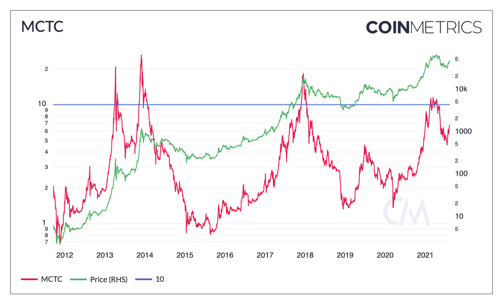

# Miner Cap to Thermo Cap \(MCTC\)

## Definition

The ratio of Miner Cap relative to Thermo Cap at the end of that interval. Miner Cap represents all funds held by mining pools and miners and is calculated as the sum of SplyMiner0HopAllUSD \(supply held by mining pools\) and SplyMiner1HopAllUSD \(supply held by miners\). Thermo Cap is RevAllTimeUSD and represents the USD value of all funds disbursed to miners at the time of issuance. 

| Name | IMetricD | Category | Subcategory | Type | Unit | Interval |
| :--- | :--- | :--- | :--- | :--- | :--- | :--- |
| Miner Cap to Thermo Cap \(MCTC\) | MCTC | Economics | Mining | Ratio | Dimensionless | 1 day |

## Details

* This metric shows the ratio between the assets that miners hold in custody relative to the assets that miners have been issued by the protocol as mining rewards.
* Like [MVRV](../market/capmvrvcur.md), it can be used to better understand the market cycle as it identifies moments where the value of the supply held by miners is higher than what was issued to them.
* Similarly, it may showcase when miners are capitulating and potentially selling at a loss.
* Miners are speculators as they are naturally exposed to the price of the currency they are mining. As such, they collectively make buy or sell decisions that ultimately impact the market.

## Chart

## Interpretation

* Historically, a threshold of 10 has been indicative of market tops. 
* When this threshold is breached, it might indicate that miners are more willing to sell their assets, as their profit margins have widened. 
* Conversely, as this ratio dips below 2, it might indicate market bottoms as miner's willingness to sell decreases. 

 

## Asset-Specific Details

Only applicable to assets for which we have SplyMiner0HopAllUSD \(supply held by mining pools\), SplyMiner1HopAllUSD \(supply held by miners\) and Thermo Cap \(RevAllTimeUSD\).

## Release History

* Release Version: NDP 5.0 \(August, 2021\)

## See Also:

* [MCRC \(Market Cap / Realized Cap\)](miner-cap-to-realized-cap-mcrc.md)
* [MVRV \(Market Cap / Realized Market Cap\)](../market/capmvrvcur.md)

## Availability for Assets



