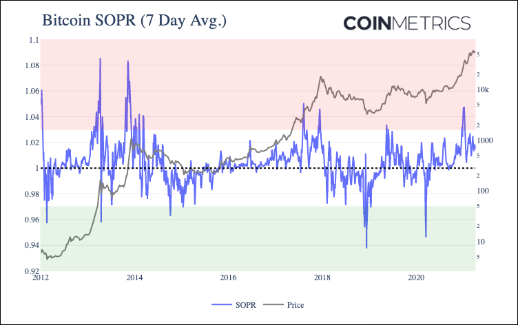

# SOPR

## Definition

The ratio of the sum of spent value over the sum of creation value of all spent and created outputs for that interval. There are two versions of this metric. For this version, a spent output’s “spent value” is the market value of the sum of all native units of that output (i.e., price multiplied by the sum of native units). A created output’s “creation value” is the market value of the sum of all native units of that output (i.e., price multiplied by the sum of native units).

| Name | MetricID | Category  | Subcategory | Type  | Unit          | Interval |
| ---- | -------- | --------- | ----------- | ----- | ------------- | -------- |
| SOPR | SOPR     | Valuation | Valuation   | Ratio | Dimensionless | 1 day    |

## Details

* (Sum of spent value) / (Sum of creation value) of all spent and created outputs for that interval)
* Sum of creation value = Sum of all transactional outputs that interval multiplied by the closing price for that interval&#x20;
* SOPR was introduced by Renato Shirakashi.
* It oscillates around 1, if below it, people spending are realizing losses, above it, realizing gains.

## Asset-Specific Details

* This metric is not available for assets that have full privacy, like Monero, Grin.
* For assets that have opt-in privacy features, like ZCash, it only takes the non-private balances into account.

## Chart

The chart above shows the combined SOPR ratio of all UTXOs spent, aggregated on a daily basis. The metric is also smoothed with a 7-day rolling average as SOPR tends to be relatively volatile.

On January 8th 2021, as BTC price topped $40K, BTC SOPR (7-day average) reached 1.048, its highest level since December 2017. The following day BTC price began to decline, and SOPR bottomed out at 1.004 on January 26th with BTC price at $32.6K. It has since rebounded to about 1.015.

## Example

* If in a given day, 3 outputs are spent:&#x20;
  * \*\* Output A, value 10 BTC, created when BTC was worth $10&#x20;
  * \*\* Output B, value 1 BTC, created when BTC was worth $500&#x20;
  * \*\* Output C, value 2 BTC, created when BTC was worth $20,000
* If market price is $7,500, SOPR for that day is computed as:&#x20;
  * \*\* Sum creation values: $10 \* 10 BTC + $500 \* 1 BTC + $20,000 \* 2 BTC = $40,600&#x20;
  * \*\* Sum spent values: $7,500 \* 10 BTC + $7,500 \* 1 BTC + $7,500 \* 2 BTC = $97,500
  * \*\* SOPR = $97,500 /$40,600 = 2.4014

## Release History

* Released in the 5.0 release of NDP

## Interpretation

Spent Output Profit Ratio (SOPR) gives another vantage point into bitcoin market cycles. Introduced [by Renato Shirakashi in 2019](https://medium.com/unconfiscatable/introducing-sopr-spent-outputs-to-predict-bitcoin-lows-and-tops-ceb4536b3b9), SOPR can act as a proxy for gauging whether holders are selling at a profit or at a loss.

SOPR is a ratio of bitcoin’s price at the time UTXOs are spent to its price at the time they were created. In other words, it’s a proxy for price sold divided by price paid. Every time a transaction occurs, we can compare bitcoin’s price at the time the UTXOs in that transaction were created to the price at which they were spent. Creating a ratio of the two gives a simple way to estimate whether the bitcoin in the UTXO was sold at a profit or loss.&#x20;

SOPR can be computed for individual UTXOs, but it can also be computed for a group of UTXOs.&#x20;

Historically, a high SOPR has signaled that bitcoin price is reaching a local maximum. Conversely, a low SOPR theoretically signals that holders are selling at a loss, which has historically indicated a good time to buy. A SOPR of 1 is also particularly important to watch, as it signals the tipping point from selling in profit to selling at a loss.

## See Also

* [SOPR Out](soprout.md)

## Availability for Assets


