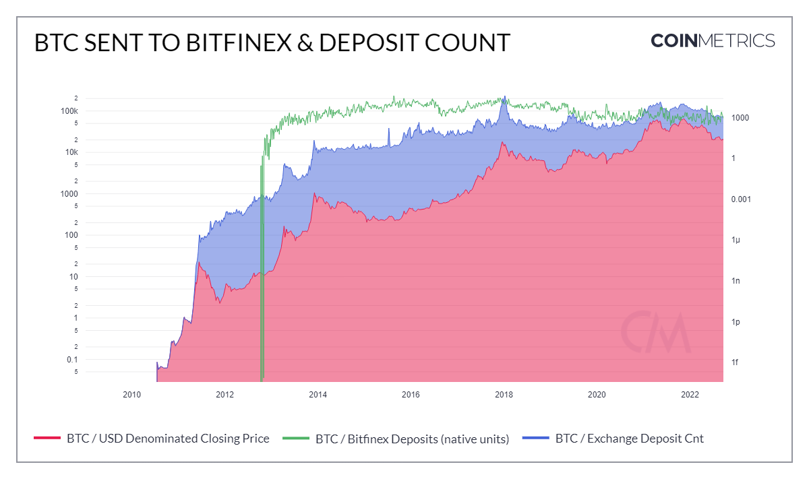

# Bitfinex Deposits (native units)

## Definition

The sum in native units sent to Bitfinex that interval.

| Name                             | MetricID     | Category | Subcategory | Type | Unit         | Interval       |
| -------------------------------- | ------------ | -------- | ----------- | ---- | ------------ | -------------- |
| Bitfinex Deposits (native units) | FlowInBFXNtv | Exchange | Deposits    | Sum  | Native units | 1 block, 1 day |

## Details

* Native units are considered as sent to an exchange if they are sent to an address we identify as being owned by an exchange.

## Chart

<figure><figcaption></figcaption></figure>

## Asset-Specific Details

* This metric might not be available for all assets. Either the exchange doesn’t support this asset, or we deemed that our coverage of the exchange was not complete enough to release the metric for it.
* For Bitcoin, this metric excludes the effect of change outputs:
  * If a transaction sends 90 BTC to exchange A but also withdraws 50 BTC from it, the flow is +40 BTC, not +90 BTC and -50 BTC.

## Examples

* During times of market stress or uncertainty, we see an uptick in BTC/funds being moved to exchanges. During the Luna collapse in spring 2021, we can see a rise in BTC being sent to both Bitfinex and Binance which is a precursor for more downside pressure as often times users are converting their funds into fiat or stable coins.

## Release History

* Released in the 4.0 release of NDP

## Interpretation

* This metric looks at the flow of funds being sent to Bitfinex and can give us a sense of market sentiment.

## Availability for Assets


