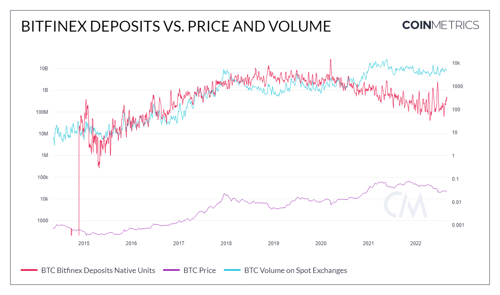

# BitMEX Deposits (USD)

## Definition

The sum USD value sent to BitMEX that interval.

| Name                  | MetricID     | Category | Subcategory | Type | Unit | Interval       |
| --------------------- | ------------ | -------- | ----------- | ---- | ---- | -------------- |
| BitMEX Deposits (USD) | FlowInBMXUSD | Exchange | Deposits    | Sum  | USD  | 1 block, 1 day |

## Details

* Computed as FlowInBMXNtv \* PriceUSD
* Native units are considered as sent to an exchange if they are sent to an address we identify as being owned by an exchange.

## Chart

<figure><figcaption></figcaption></figure>

## Asset-Specific Details

* This metric might not be available for all assets. Either that exchange doesn’t support this asset (BitMEX only trades in BTC for example), or we deemed that our coverage of the exchange was not complete enough to release the metric for it.
* For Bitcoin, this metric excludes the effect of change outputs:
*
  * If a transaction sends 90 BTC to exchange A but also withdraws 50 BTC from it, the flow is +40 BTC, not +90 BTC and -50 BTC.

## Examples

* The amount of deposits in USD on Bitfinex is directly correlated with the total amount of BTC spot volume across all exchanges.

## Release History

* Released in the 4.0 release of NDP

## Interpretation

* This measures the flow of funds to the Bitfinex exchange measured in USD. Used to gauge activity on the exchange. Often times if an extreme amount of funds are being deposited to an exchange from cold storage, it could indicate users are selling to fiat or stablecoins which could be be a bearish signal.

## Availability for Assets


