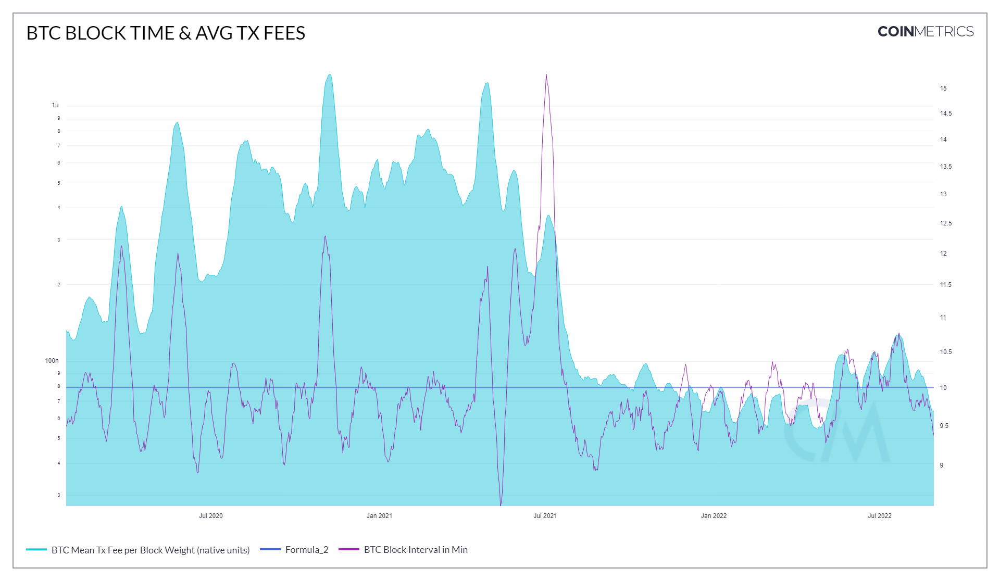

# Mean Tx Fee per Byte (native units)

## Definition

The mean transaction fee per byte of all blocks that interval in native units.

| Name                                | MetricID       | Category         | Subcategory | Type | Unit         | Interval |
| ----------------------------------- | -------------- | ---------------- | ----------- | ---- | ------------ | -------- |
| Mean Tx Fee per Byte (native units) | FeeByteMeanNtv | Fees and Revenue | Fees        | Mean | Native units | 1 day    |

## Details

* 0-fee transactions are included
* Computed as FeeTotNtv / BlkSizeByte
* If there were no transactions that interval, this metric isn’t computed

## Chart

<figure><figcaption></figcaption></figure>

## Asset Specific Details

Any blockchain where users are paying for block space rather than computation.

## Examples

During the BTC mining ban in China in 2021, we saw an influx of miners turn off their operations so the block interval time increased significantly due to less hash power on the network. In effect, because less miners were online, we saw a spike in the mean transaction fee per byte since less miners were available to include transactions in the blocks, therefore transactions costs higher before the next difficulty adjustment.

## Release History

* Release Version: NDP-EOD 4.8 (Nov, 2020)

## Availability for Assets


