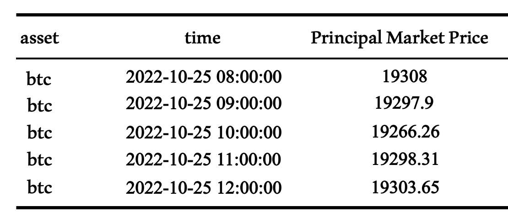

# Principal Market Price (USD)

## **Definition**

The Principal Market Price is the price of an asset quoted in U.S. dollars derived from the asset's principal market, the market with the most trading volume or activity.

| Name                   | **MetricID**                  | **Category** | **Subcategory** | **Type** | **Unit** | **Interval**   |
| ---------------------- | ----------------------------- | ------------ | --------------- | -------- | -------- | -------------- |
| Principal Market Price | principal\_market\_price\_usd | Market       | Price           | n/a      | USD      | 1d, 1h, 1m, 1s |

## Details

* View our [Principal Market Price methodology](https://docs.coinmetrics.io/market-data/methodologies/principal-market-price-methodology) for more information.

## **Example**

A sample of the Principal Market Price data for Bitcoin is shown below:

<figure><figcaption></figcaption></figure>

* asset:  The IDs of the asset.  &#x20;
* time: The principal market price time in ISO 8601 date-time format.
* principal\_market\_price:  The principal market price value.

## Release History

* Release Version: Principal Market Price v1.0 (October 25, 2022) - initial version

## **Availability for Assets**

Community and pro asset availability does not differ.  Community is available via HTTP API only, is limited to 1,000 API requests per 10 minutes per IP address and only showcases the last 24 hours of history for the 1 hour, 1 min and 1 second prices.&#x20;


