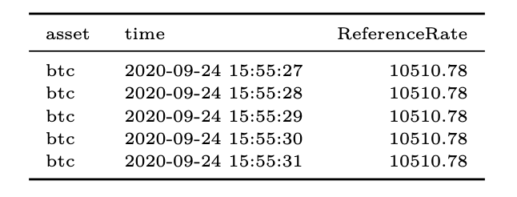

# Reference Rate (USD)

## **Definition**

Reference Rates are designed to represent the price of a cryptoasset in an arms length transaction between a willing buyer and willing seller. It is designed to reflect the price where the majority of trades took place for a given cryptoasset using multiple markets as input data sources.

| Name            | **MetricID**      | **Category** | **Subcategory** | **Type** | **Unit** | **Interval**                |
| --------------- | ----------------- | ------------ | --------------- | -------- | -------- | --------------------------- |
| Reference Rates | ReferenceRates    | Market       | Price           | n/a      | USD      | 1d, 1d-ny-close, 1h, 1m, 1s |
| Reference Rates | ReferenceRatesUSD | Market       | Price           | n/a      | USD      | 1d, 1d-ny-close, 1h, 1m, 1s |

## Details

* Hourly (1h, 1d): A systematic framework evaluates and selects a unique set of constituent markets for each cryptoasset and the methodology utilizes volume-weighted median and time- weighted average price techniques. The Reference Rates utilizes a 61-minute window to calculate prices once an hour, every hour, including on weekends and holidays. The Reference Rates can be used for portfolio accounting, as settlement prices for financial derivative contracts, and as closing prices for investment products.
* Real-time (1s, 1m):  Similar to the hourly Reference Rates, the Real-Time Reference Rates are designed to represent the price of a cryptoasset in an arms length transaction between a willing buyer and willing seller. Rather than being calculated once an hour, the Real-Time Reference Rates has a separate methodology that utilizes volume-weighted median and inverse price variance weighting techniques to calculate prices once a second, every second, including on weekends and holidays.&#x20;
* View our [**Real-time**](https://coinmetrics.io/rtrr-methodology/) and [**Hourly**](https://coinmetrics.io/reference-rates-methodology/) reference rates methodology for more information.  Also, see our [**Market Selection Framework**](https://coinmetrics.io/reference-rates-market-selection-framework/) **** for our exchange selection criteria.

## **Example**

A sample of the hourly reference rates data for Bitcoin is shown below:

.png>)

A sample of the real-time reference rates data for Bitcoin is shown below:

* asset:  The IDs of the asset.  &#x20;
* time: The reference rate time in ISO 8601 date-time format.
* ReferenceRate:  The reference rate value.

## Release History

* Release Version: Reference Rates v1.0 (May 15, 2019) - initial version
* Release Version: Reference Rates v1.1 (May 31, 2019)  - publication of historical prices and revised methodology
* Release Version: Reference Rates v1.2 (June 14, 2019) - expansion of coverage universe (+9 assets)
* Release Version: Reference Rates v2.0 (July 9, 2019) - publication of rates hourly, publication of historical hourly rates, human oversight of fixings, expansion of coverage universe (+93 assets)
* Release Version: Reference Rates v2.1 (Aug 30, 2019) - publishing to v2 API (in addition to v2), recalculation&#x20;
* Release Version:  Real-time Reference Rates Beta (Aug 30, 2019) - initial version
* Release Version: Real-time Reference Rates v0.1 (Dec 9, 2019) - methodology enhancements
* Release Version: Reference Rates v2.2 (Feb 7, 2020) - updates to constituent markets, asset coverage termination for a number of assets, update to reflect Maker’s protocol upgrade
* Release Version: Real-time Reference Rates v0.2 (Feb 7, 2020) - updates to constituent markets, asset coverage termination for a number of assets, update to reflect Maker’s protocol upgrade
* Release Version: Reference Rates v2.3 (March 5, 2020) - expansion of coverage universe (+24)&#x20;
* Release Version: Real-time Reference Rates v0.4 (March 5, 2020) -  expansion of coverage universe (+24)&#x20;
* Release Version: Reference Rates v2.4 (Aug 7, 2020) - expansion of coverage universe (+28), asset coverage termination (-3), reconstitutions of our whitelisted markets, recalculation of certain assets, change in the recalculation methodology
* Release Version: Real-time Reference Rates v0.5 (Aug 7, 2020) - expansion of coverage universe (+28), asset coverage termination (-3), reconstitutions of our whitelisted markets, recalculation of certain assets, change in the recalculation methodology

## **Availability for Assets**

Community and pro asset availability does not differ.  Community is available via HTTP API only, is limited to 1,000 API requests per 10 minutes per IP address and only showcases the last 24 hours of history for the 1 hour, 1 min and 1 second rates.&#x20;




