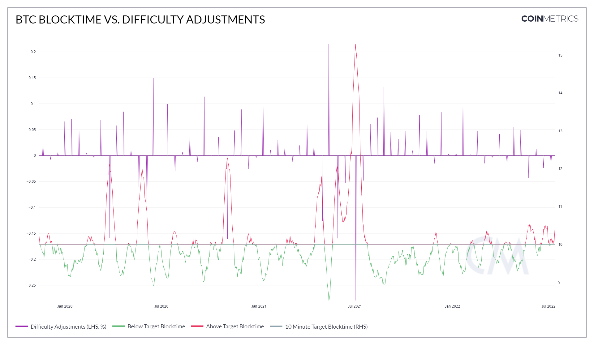
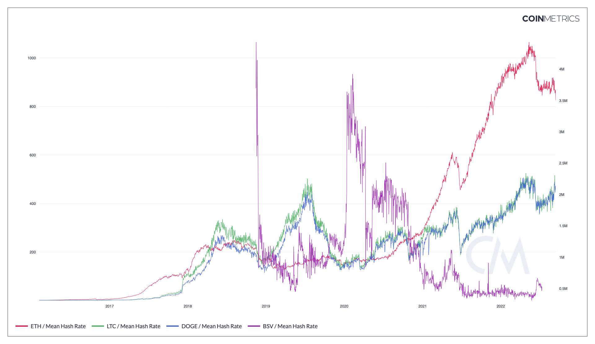

# Difficulty

## Definition

The difficulty of the last block in the considered time period. Difficulty represents how hard it is to find a hash that meets the protocol-designated requirement (i.e., the difficulty of finding a new block) that day. The requirement is unique to each applicable cryptocurrency protocol. Difficulty is adjusted periodically by the protocol as a function of how much hashing power is being deployed by miners.

| Name       | MetricID | Category | Subcategory | Type | Unit          | Interval      |
| ---------- | -------- | -------- | ----------- | ---- | ------------- | ------------- |
| Difficulty | DiffLast | Mining   | Mining      | Mean | Dimensionless | 1 day, 1 hour |

## Details

* This metric is not comparable across all chains as its value is dependent on the hashing function used by each chain.

## Chart

<figure><figcaption></figcaption></figure>

## Chart

<figure><figcaption>
Source: CM Network Data Charts
</figcaption></figure>

## Asset-Specific Details

* This metric is only available for PoW chains.

## Examples

* Bitcoin’s mining difficulty is a network-determined parameter that automatically adjusts roughly every 2 weeks (2,016 Bitcoin blocks) to target a 10-minute block interval. To maintain this frequency, the algorithm steps in and increases or decreases the difficulty of mining Bitcoin depending on the mining activity on the network. When China banned BTC mining in Q2 of 2021, we saw a drop in mining activity on the network, therefore the difficulty dropped as well.

## Release History

* Released in the 4.2 release of NDP

## Interpretation

* Difficulty is a measure of how difficult it is to mine a block. The greater the difficulty, the more computational power is needed to mine a block.

## See Also


[hashrate.md](hashrate.md)



[diffmean.md](diffmean.md)



[blkintmean.md](../network-usage/blkintmean.md)


## Availability for Assets


