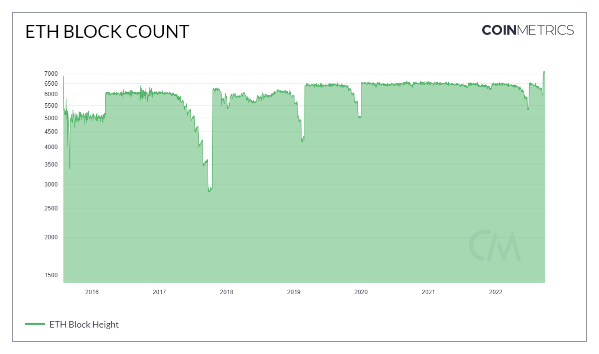

# Block Cnt

## Definition

The sum count of blocks created that interval that were included in the main (base) chain.

| Name      | MetricID | Category      | Subcategory | Type | Unit   | Interval      |
| --------- | -------- | ------------- | ----------- | ---- | ------ | ------------- |
| Block Cnt | BlkCnt   | Network Usage | Blocks      | Sum  | Blocks | 1 day, 1 hour |

## Details

* Only mainchain (non-orphaned/uncles) blocks are counted.
* For chains that use median time, the day is defined using it, otherwise, it’s defined using the block’s timestamps.

## Chart

<figure><figcaption></figcaption></figure>

## Asset-Specific Details

* Every blockchain will have a Block Count measurement as it's a fundamental aspect of the the distributed ledger technology.

## Examples

* The drawdowns in the ETH block counts can be explained by the numerous hard forks. Block difficulty would rise making it harder for miners to find the next block resulting in an increase in time between blocks therefore less blocks are created each day.

## Release History

* Released in the 1.0 release of NDP

## Interpretation

Block count is typically rather static, but can vary in blockchains which rely on a poisson process for finding new blocks. In proof-of-work chains with long difficulty adjustment windows and significant variance in block times, like Bitcoin, block count can diverge widely from the expected rate. This can happen during competitions for hashpower around the time of forks, or when a significant amount of hashpower is added or subtracted from the blockchain in a short period.

## Availability for Assets


