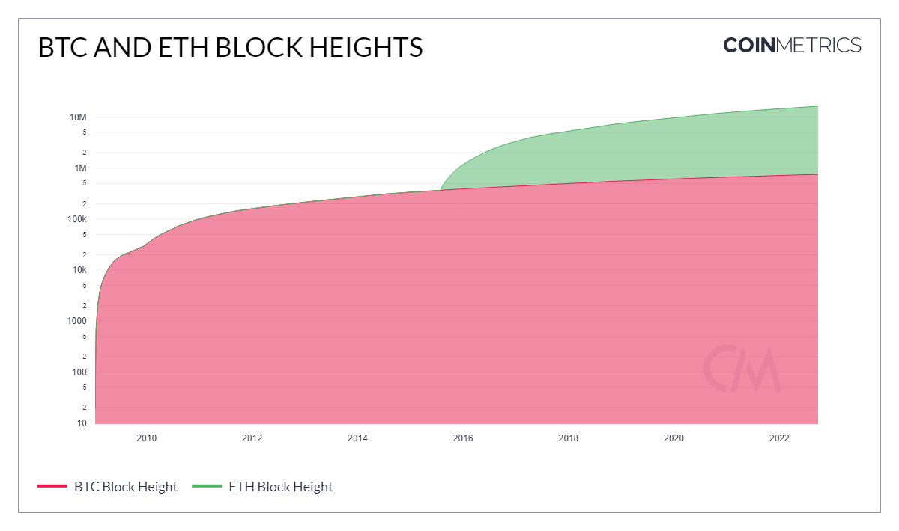

# Block Height

## Definition

The count of blocks from the genesis (first) block to the last block of that interval on the main chain (in other words, the total number of blocks ever created and included on the chain).

## Dictionary

| Name         | MetriID | Category      | Subcategory | Type | Unit   | Interval               |
| ------------ | ------- | ------------- | ----------- | ---- | ------ | ---------------------- |
| Block Height | BlkHgt  | Network Usage | Blocks      | Sum  | Blocks | 1 block, 1 day, 1 hour |

## Details

* Only mainchain (non-orphaned/uncles) blocks are counted.
* For chains that use median time, the day is defined using it, otherwise, it’s defined using the block’s timestamps

## Chart

<figure><figcaption></figcaption></figure>

## Asset-Specific Details

* Every blockchain will have a Block Height measurement as it's a fundamental aspect of the the distributed ledger technology.

## Examples

* Depending on the blockchain, blocks can be produced at different intervals. The longer a blockchain has been in existence and the faster the blocks are produced, the larger the block height will be. ETH blocks are produced every 14 seconds compared to BTC where blocks are created every 10 minutes or so. Therefore, the block height for ETH will be significantly larger than BTC.

## Release History

* Released in the 4.3 release of NDP

## Interpretation

* New transactions are grouped and added to new blocks on the blockchain. Each block is linked to the previous one and they essentially are stacked together

## Availability for Assets


