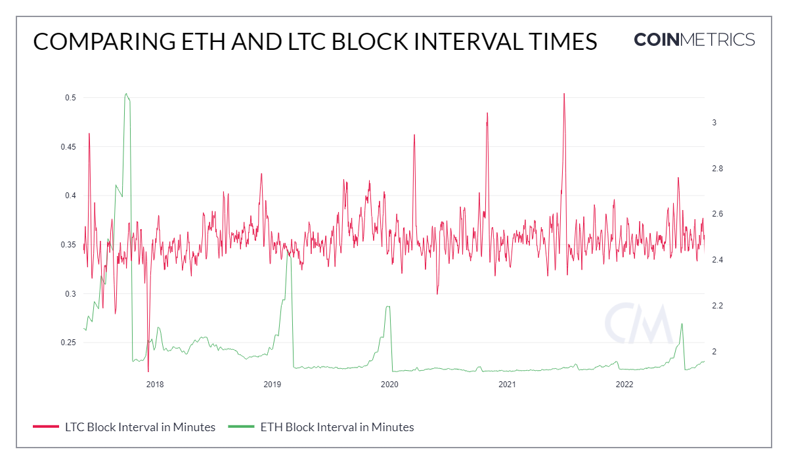

# Mean Block Interval (seconds)

## Definition

The mean time (in seconds) between all the blocks created that interval.

| Name            | MetricID   | Category      | Subcategory | Type | Unit    | Interval               |
| --------------- | ---------- | ------------- | ----------- | ---- | ------- | ---------------------- |
| Mean Time Block | BlkIntMean | Network Usage | Blocks      | Mean | Seconds | 1 block, 1 day, 1 hour |

## Details

* Only mainchain (non-orphaned/uncles) blocks are counted.
* For chains that use median time, the day is defined using it, otherwise, it’s defined using the block’s timestamps.
* The absolute interval is used (if block n+1 has a timestamp lower than block n, we use the absolute value of the difference in timestamps, see examples).
* For the block-by-block frequency, it can be interpreted as the amount of time between the publishing of the previous block and the most recent block.&#x20;
  * For example, Block 1 is published at a timestamp of 02:00:00 UTC, Block 2 is published at a timestamp of 02:10:00 UTC, so the BlkIntMean would just be 10m for Block 2.

## Chart

<figure><figcaption></figcaption></figure>

## Asset Specific Details

* On average, Litecoin produces blocks every 2.5 minutes where Ethereum takes around 14 seconds on average

## Example

If for a day, the blocks are:

The value of BlkIntMean would be (120 + 20 + 160 + 60) / 4 = 90 seconds

## Release History

* Released in the 1.0 release of NDP

## Interpretation

Blockchains with shorter block time (and hence a larger sample size per day) will typically have less variance in mean block interval.

## Availability for Assets


