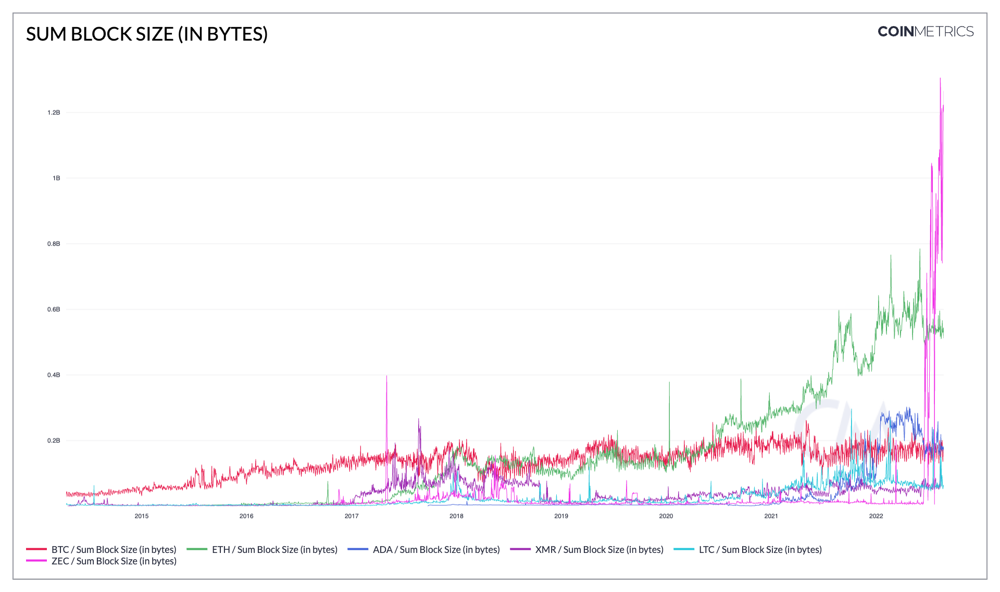

# Sum Block Size (in bytes)

## Definition

The sum of the size (in bytes) of all blocks created that interval.

## Dictionary

| Name                      | MetricID    | Category      | Subcategory | Type | Unit  | Interval               |
| ------------------------- | ----------- | ------------- | ----------- | ---- | ----- | ---------------------- |
| Sum Block Size (in bytes) | BlkSizeByte | Network Usage | Blocks      | Sum  | Bytes | 1 day, 1 block, 1 hour |

## Details

* Only mainchain (non-orphaned/uncles) blocks are counted.
* For chains that use median time, the day is defined using it, otherwise, it’s defined using the block’s timestamps.

## Chart

<figure><figcaption>
<em>Source:</em> <a href="https://charts.coinmetrics.io/network-data/#4297"><em>CM Network Data Charts</em></a>
</figcaption></figure>

## Asset-Specific Details

* This metric is not available for all assets, as some node’s RPC APIs do not expose the size of the blocks.

## Release History

* Released in the 1.0 release of NDP

## Interpretation

* Can be used to measure and compare blockchains' usages and fees
* Can help gauge gas/fee for large transactions:
  * fee per byte = total block fee/block size (byte)

## See Also

* [Mean Block Size (in bytes)](https://docs.coinmetrics.io/asset-metrics/network-usage/blksizemeanbyte)
* [Mean Tx Fee per Byte (native units)](https://docs.coinmetrics.io/asset-metrics/fees-and-revenue/feebytemeanntv)

## Availability for Assets


