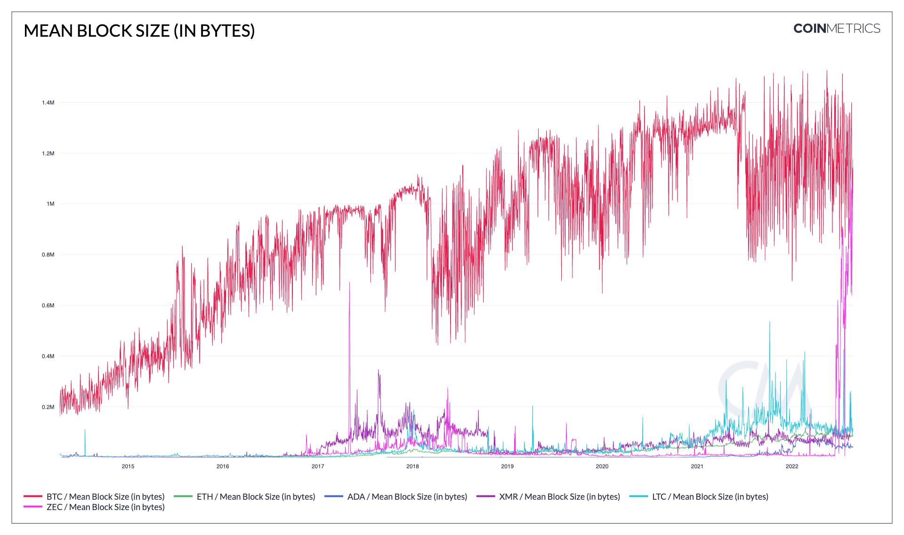

# Mean Block Size (in bytes)

## Definition

The mean size (in bytes) of all blocks created that interval.

## Dictionary

| Name                       | MetricID        | Category      | Subcategory | Type | Unit  | Interval |
| -------------------------- | --------------- | ------------- | ----------- | ---- | ----- | -------- |
| Mean Block Size (in bytes) | BlkSizeMeanByte | Network Usage | Blocks      | Mean | Bytes | 1 day    |

## Details

* Only mainchain (non-orphaned/uncles) blocks are counted.
* For chains that use median time, the day is defined using it, otherwise, it’s defined using the block’s timestamps.

## Chart

<figure><figcaption>
Source: <a href="https://charts.coinmetrics.io/network-data/#4298">CM Network Data Charts</a>
</figcaption></figure>

## Asset-Specific Details

* This metric is not available for all assets, as some node’s RPC API do not expose the size of the blocks.

## Release History

* Released in the 1.0 release of NDP

## Interpretation

Mean block size is somewhat arbitrary; block count multiplied by mean block size gives you the total data throughput on a blockchain per day. Blockchains with shorter interblock times will often have smaller blocks but may throughput more data than their higher-latency peers.

## See Also

* [Sum Block Size (in bytes)](https://docs.coinmetrics.io/asset-metrics/network-usage/blksizebyte)

## Availability for Assets


