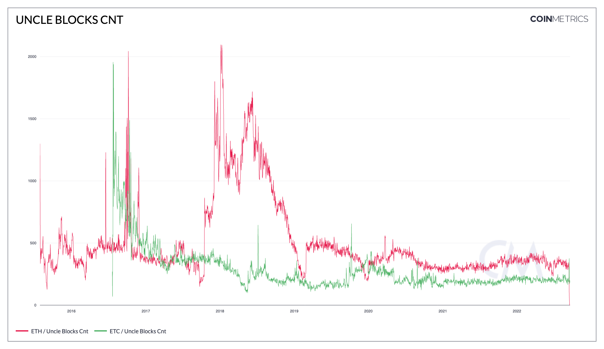

# Uncle Blocks Cnt

## Definition

The sum count of uncle blocks mined in that interval.

## Dictionary

| Name             | MetricID  | Category      | Subcategory | Type  | Unit   | Interval       |
| ---------------- | --------- | ------------- | ----------- | ----- | ------ | -------------- |
| Uncle Blocks Cnt | BlkUncCnt | Network Usage | Blocks      | Count | Uncles | 1 block, 1 day |

## Details

* Uncle Blocks (also known as Ommer Blocks) are an intrinsic feature of Ethereum.
* Unlike Bitcoin, Ethereum does not discard blocks in situations where multiple miners find a valid block of the same height.
* Instead, Ethereum rewards secondary miners with so-called Uncle Blocks, which effectively represent a share of the work, as well as the reward, of processing transactions.
* Uncle blocks are not included in the asset’s main chain but are referenced by main chain blocks. Both the main chain block and uncle block miners get an extra reward for this.

## Chart

<figure><figcaption>
Source: <a href="https://charts.coinmetrics.io/network-data/#4237">CM Network Data Charts</a>
</figcaption></figure>

## Asset-Specific Details

* This metric is only relevant to ETH and ETC

## Release History

* Released in the 4.3 release of NDP
* Deprecated post the Ethereum Merge

## Interpretation

* The more uncle blocks there are, the more uncertainty there might be around the finality of those related payments

## See Also

* [Miner Revenue from Uncle Blocks (%)](https://docs.coinmetrics.io/asset-metrics/network-usage/blkuncrevpct)
* [Uncle Reward (native units)](https://docs.coinmetrics.io/asset-metrics/network-usage/blkuncrwd)
* [Uncle Reward (USD)](https://docs.coinmetrics.io/asset-metrics/network-usage/blkuncrwdusd)

## Availability for Assets


