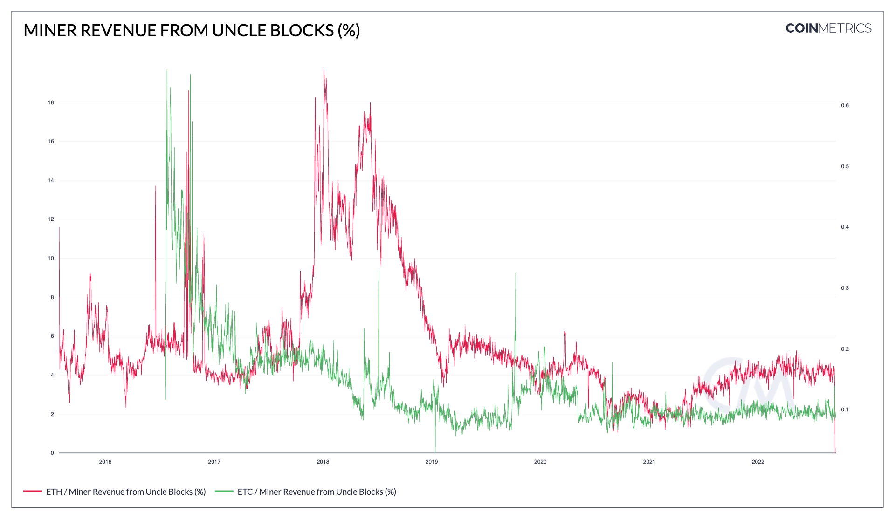

# Miner Revenue from Uncle Blocks (%)

## Definition

The percentage of miner revenue exclusively derived from creating and including uncle blocks in that interval. This is equal to the sum of the uncle inclusion reward (for the main chain block miner) and the uncle rewards (for the uncle block miners) divided by the miner revenue.

## Dictionary

| Name                                | MetricID     | Category      | Subcategory | Type       | Unit          | Interval |
| ----------------------------------- | ------------ | ------------- | ----------- | ---------- | ------------- | -------- |
| Miner Revenue from Uncle Blocks (%) | BlkUncRevPct | Network Usage | Blocks      | Percentage | Dimensionless | 1 day    |

## Details

* Uncle Blocks (also known as Ommer Blocks) are an intrinsic feature of Ethereum.
* Unlike Bitcoin, Ethereum does not discard blocks in situations where multiple miners find a valid block of the same height.
* Instead, Ethereum rewards secondary miners with so-called Uncle Blocks, which effectively represent a share of the work, as well as the reward, of processing transactions.
* This metric measures the proportion of rewards that resulted from Uncle Blocks.

## Chart

<figure><figcaption>
Source: <a href="https://charts.coinmetrics.io/network-data/#4250">CM Network Data Charts</a>
</figcaption></figure>

## Asset-Specific Details

* This metric is only relevant to ETH & ETC

## Release History

* Release Version: NDP-EOD 4.8 (Nov, 2020)
* Deprecated post the Ethereum Merge

## See Also

* [Uncle Blocks Cnt](https://docs.coinmetrics.io/asset-metrics/network-usage/blkunccnt)
* [Uncle Reward (native units)](https://docs.coinmetrics.io/asset-metrics/network-usage/blkuncrwd)
* [Uncle Reward (USD)](https://docs.coinmetrics.io/asset-metrics/network-usage/blkuncrwdusd)

## Availability for Assets


