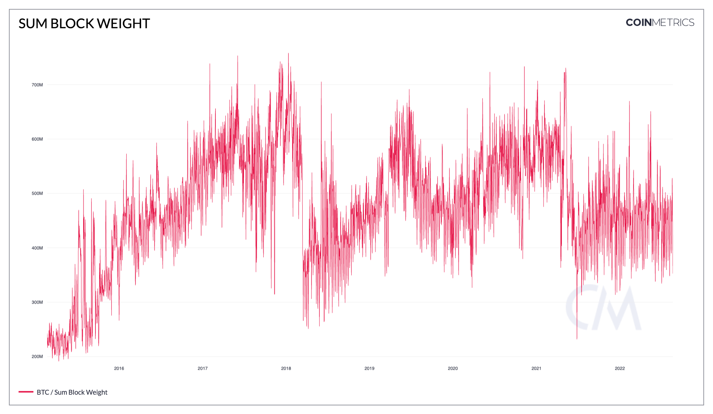

# Sum Block Weight

## Definition

The sum weight of all blocks created that interval. Weight is a dimensionless measure of a block’s “size”. It is only applicable for chains that use SegWit (segregated witness).

## Dictionary

| Name             | MetricID   | Category      | Subcategory | Type | Unit          | Interval |
| ---------------- | ---------- | ------------- | ----------- | ---- | ------------- | -------- |
| Sum Block Weight | BlkWghtTot | Network Usage | Blocks      | Mean | Dimensionless | 1 day    |

## Details

* Only mainchain (non-orphaned/uncles) blocks are counted.
* For chains that use median time, the day is defined using it, otherwise, it’s defined using the block’s timestamps.

## Chart

<figure><figcaption>
Source: <a href="https://charts.coinmetrics.io/network-data/#4254">CM Network Data Charts</a>
</figcaption></figure>

## Asset-Specific Details

* This metric is only available for assets that support SegWit.

## Release History

* Released in the 4.9 release of NDP

## Interpretation

Block weight is useful to determine how used a chain is.

## See Also

* [Mean Block Weight](https://docs.coinmetrics.io/asset-metrics/network-usage/blkwghtmean)

## Availability for Assets


