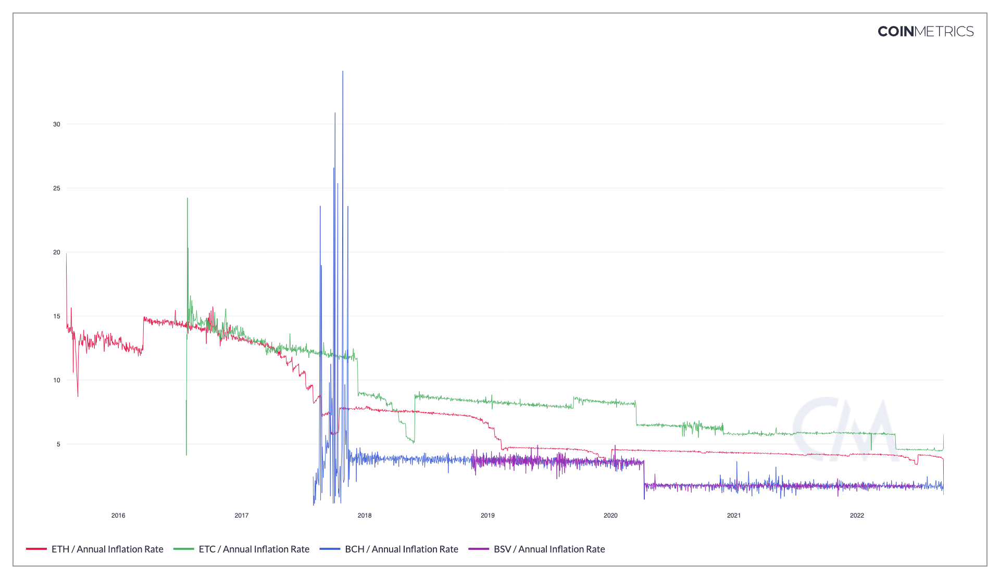

# Annual Inflation Rate

## Definition

The percentage of new native units (continuous) issued on that day, extrapolated to one year (i.e., multiplied by 365), and divided by the current supply on that day. Sometimes referred to as the annual inflation rate.

| Name                  | MetricID      | Category | Subcategory | Type       | Unit          | Interval |
| --------------------- | ------------- | -------- | ----------- | ---------- | ------------- | -------- |
| Annual Inflation Rate | IssContPctAnn | Supply   | Issuance    | Percentage | Dimensionless | 1 year   |

## Details

* This metric can be seen as the asset’s annualized inflation rate. Note that it only includes the predictable inflation, some other emission schedule could happen that would lead to this metric under-estimating the inflation.
* Computed as 100 \* IssContNtv \* 365 / SplyCur
* A value of 1.0 means that the asset’s supply will increase by 1% per year.
* This metric extrapolates the issuance rate from the current day’s issuance. It doesn’t take into account changes that will happen after the day of this metric’s computation like ETH unpredictable changes in monetary policy (no forward knowledge).

## Chart

<figure><figcaption>
Source: CM Network Data Charts
</figcaption></figure>

## Asset-Specific Details

* For XLM, the inflation process is considered continuous issuance as it is protocol mandated and predictable.

## Release History

* Released in the 1.0 release of NDP

## Interpretation

While colloquially referred to as the inflation rate, this should be understood as supply inflation, not the conventional understanding of inflation as a decline in purchasing power driven by new supply. This metric might more appropriately be called the annualized issuance rate. Coins already existing in circulation but held in an encumbered state (like XRP being released from escrow) are not included in the measure as they are already incorporated in supply.

## See Also

* [Daily Inflation Rate](https://docs.coinmetrics.io/asset-metrics/supply/isscontpctday#details)

## Availability for Assets


