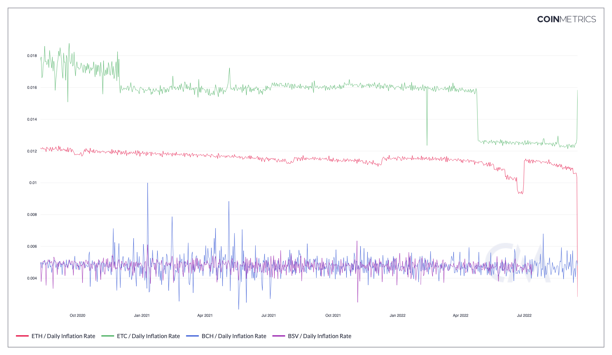

# Daily Inflation Rate

## Definition

The percentage of new native units (continuous) issued on that day divided by the current supply on that day. Also referred to as the daily inflation rate.

| Name                 | MetricID      | Category | Subcategory | Type       | Unit          | Interval |
| -------------------- | ------------- | -------- | ----------- | ---------- | ------------- | -------- |
| Daily Inflation Rate | IssContPctDay | Supply   | Issuance    | Percentage | Dimensionless | 1 day    |

## Details

* This metric can be seen as the asset’s daily inflation rate. Note that it only includes the predictable inflation, some other emission schedule could happen that would lead to this metric under-estimating the inflation.
* Computed as 100 \* IssContNtv / SplyCur
* Also equivalent to IssContPctAnn / 365
* A value of 1.0 means that the asset’s monetary policy is a 1% daily inflation.

## Chart

<figure><figcaption>
Source: CM Network Data Chart
</figcaption></figure>

## Asset-Specific Details

* For XLM, the inflation process is considered continuous issuance as it is protocol mandated and predictable.

## Release History

* Released in the 1.0 release of NDP

## See Also

* [Annual Inflation Rate](https://docs.coinmetrics.io/asset-metrics/supply/isscontpctann?q=inflation)

## Availability for Assets


