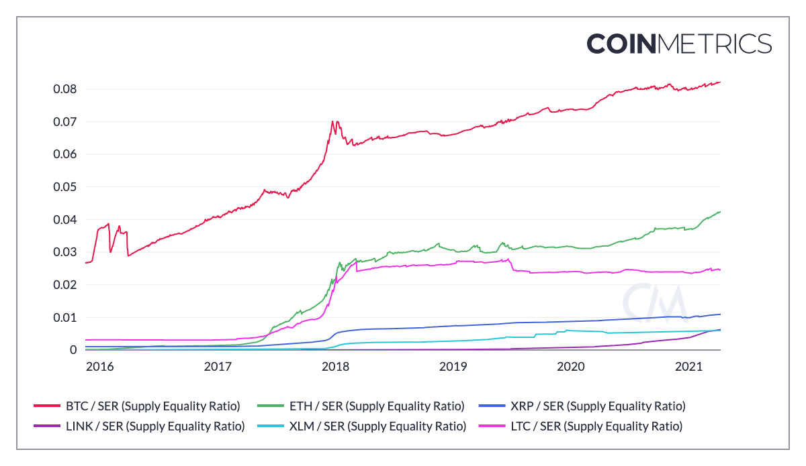

# SER \(Supply Equality Ratio\)

## Definition

The ratio of supply held by addresses with less than one ten-millionth of the current supply of native units to the supply held by the top one percent of addresses.

| Name | MetricID | Category | Subcategory | Type | Unit | Interval |
| :--- | :--- | :--- | :--- | :--- | :--- | :--- |
| SER \(Supply Equality Ratio\) | SER | Supply | Current | Ratio | Dimensionless | 1 day |

## Charts

Of the assets shown above, Bitcoin has the highest SER, followed by Ether and Litecoin. The sustained increase in Bitcoin’s SER shows that, in spite of large institutions entering the space, Bitcoin is still very much a grassroots movement.  

## Interpretation

Supply Equality Ratio \(SER\). It is analogous to the [20:20 Ratio](https://en.wikipedia.org/wiki/Income_inequality_metrics#20:20_Ratio); a traditional wealth inequality metric that compares the average income of the richest 20% of a society to the poorest 20%. Instead of income, the SER looks at supply held by different accounts within a network. It compares the poorest accounts \(the sum held by all accounts with a balance less than 0.00001% of the supply\) against the richest accounts \(the sum held by all the top 1% addresses\). 

A high SER signifies high distribution of supply. 

While SER provides a novel look into supply distribution that is not possible with most traditional assets, an important caveat is that a single individual can own many cryptoasset addresses. As such, an individual might hold many addresses and supply distribution does not directly map to an individual’s holdings.  Also, assets custodied by large financial institutions increases SER’s denominator and puts overall downward pressure on the ratio.  

## Availability for Assets



