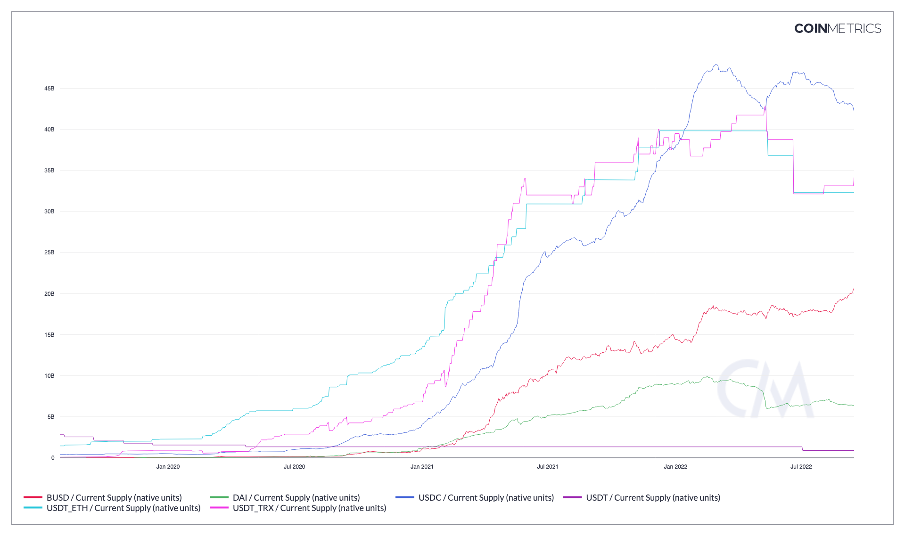

# Current Supply (native units)

## Definition

The sum of all native units ever created and currently visible on the ledger (i.e., issued) as of that day. For account-based protocols, only accounts with positive balances are counted.

| Name                          | MetricID | Category | Subcategory | Type | Unit         | Interval |
| ----------------------------- | -------- | -------- | ----------- | ---- | ------------ | -------- |
| Current Supply (native units) | SplyCur  | Supply   | Current     | Sum  | Native units | All time |

## Details

* This metric might be also be characterized as “total issued supply” as it captures the sum of all native units visible in the ledger up until the metric calculation point
* For UTXO chains, current supply is the sum of all unspent output values.
* For account chains, current supply is the sum of all account balances.

## Chart

<figure><figcaption>
Source: CM Network Data Charts
</figcaption></figure>

## Asset-Specific Details

* For ZEC, it includes the shielded pools value
* For Ripple, escrows are counted towards total current supply.
* For privacy coins like Monero or Grin, total current supply is computed by summing up mining rewards.

## Release History

* Released in the 1.0 release of NDP

## See Also

* [Shielded Supply](https://docs.coinmetrics.io/asset-metrics/supply/splyshld)

## Availability for Assets


