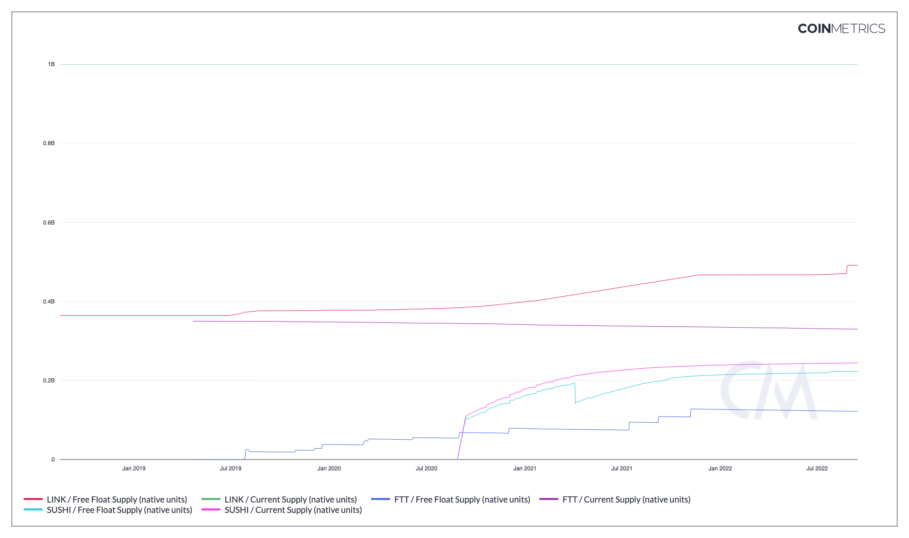

# Free Float Supply (native units)

## Definition

The sum of all native units ever created and visible on the ledger excluding native units held closely by company insiders, controlling investors and long term strategic holders as of that day.

| Name                             | MetricID | Category | Subcategory       | Type | Unit         | Interval |
| -------------------------------- | -------- | -------- | ----------------- | ---- | ------------ | -------- |
| Free Float Supply (native units) | SplyFF   | Supply   | Free Float Supply | Sum  | Native units | All time |

## Details

* Free Float Supply is a measure of supply that excludes tokens are locked up or dormant for a long time. For example, tokens that are inactive for greater than five years, owned by company, blockchain foundation or founding team member(s) that may or may not be subject to escrows, burnt or lost, etc.
* Our free float value constantly shows a lower value than either the reported supply by foundations/companies or total visible on-chain supply.
* Please refer to the CMBI Adjusted Free Float Methodology for asset treatment: [https://coinmetrics.io/wp-content/uploads/2021/01/CMBI-Adjusted-Free-Float-Methodology-v1.0.pdf](https://coinmetrics.io/wp-content/uploads/2021/01/CMBI-Adjusted-Free-Float-Methodology-v1.0.pdf)
* For supported assets and tagged addresses, please refer to the CM gitlab SplyFF.json

## Chart

<figure><figcaption>
Source: Network Data Charts
</figcaption></figure>

## Release History

* Released in the 4.8 release of NDP
* Free Float expanded to DOT, UNI, UMA, Aave, Yearn, Curve, REN, and BAL in the 4.9 release of NDP

## Asset-Specific Details

* ETH Free Float Supply includes tokens on the Consensus Layer and Execution Layer\

## **See Also**

* [Introducing Fee Float Supply](https://coinmetrics.io/introducing-free-float-supply/)&#x20;
* [Creating a Better Supply Measurement: Free Float Supply](https://coinmetrics.substack.com/p/coin-metrics-state-of-the-network-7d0)
* Quarterly Transparency Reports (in [Original Research](https://coinmetrics.io/insights/original-research/))&#x20;

## **Availability for Assets**


