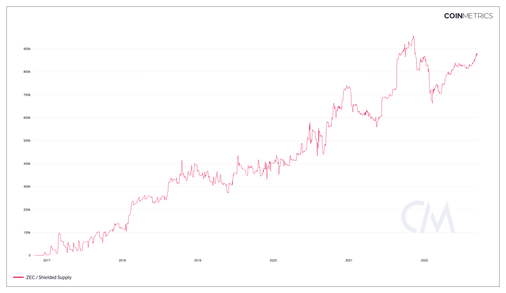

# Shielded Supply

## Definition

The sum of all native units being held in shielded pool(s).

| Name            | MetricID | Category | Subcategory | Type | Unit         | Interval |
| --------------- | -------- | -------- | ----------- | ---- | ------------ | -------- |
| Shielded Supply | SplyShld | Supply   | Shielded    | Sum  | Native units | All time |

## Details

* This metric takes into account all shielded pools that an asset may have.
* Shielded pools are where private transfers can happen in ZEC-like assets. Blockchain observers can only see coins coming in or out of the pool, but have no details about the transfers happening inside the pool.

## Chart

<figure><figcaption>
Source: CM Network Data Charts
</figcaption></figure>

## Asset-Specific Details

* Only relevant for ZEC and its derivatives.

## Release History

* Released in the 4.2 release of NDP

## See Also

* [Current Supply](https://docs.coinmetrics.io/asset-metrics/supply/splycur)
* [Shielded Tx Cnt](https://docs.coinmetrics.io/asset-metrics/transactions/txshldcnt)
* [Fully Shielded Tx Cnt](https://docs.coinmetrics.io/asset-metrics/transactions/txshldfullcnt)

## Availability for Assets


