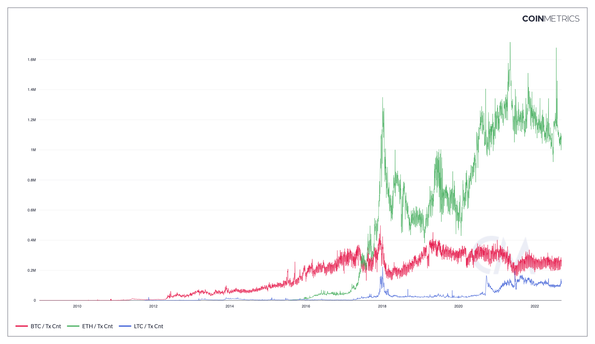

# Tx Cnt

## Definition

The sum count of transactions that day. Transactions represent a bundle of intended actions to alter the ledger initiated by a user (human or machine). On certain occasions, transactions are counted regardless of whether they result in the transfer of native units or not. As long as such transactions are recorded on the chain, they will be included in the calculation of this metric. Changes to the ledger algorithmically mandated by the protocol, such as coinbase transactions or post-launch new issuance, are not included here.

| Name   | MetricID | Category     | Subcategory  | Type | Unit         | Interval      |
| ------ | -------- | ------------ | ------------ | ---- | ------------ | ------------- |
| Tx Cnt | TxCnt    | Transactions | Transactions | Sum  | Transactions | 1 day, 1 hour |

## Details

* For UTXO chains, this metric doesn’t include coinbase transactions.

## Chart

<figure><figcaption>
Source: Coin Metrics Network Data Chart
</figcaption></figure>

## Release History

* Released in the 1.0 release of NDP

## Availability for Assets


