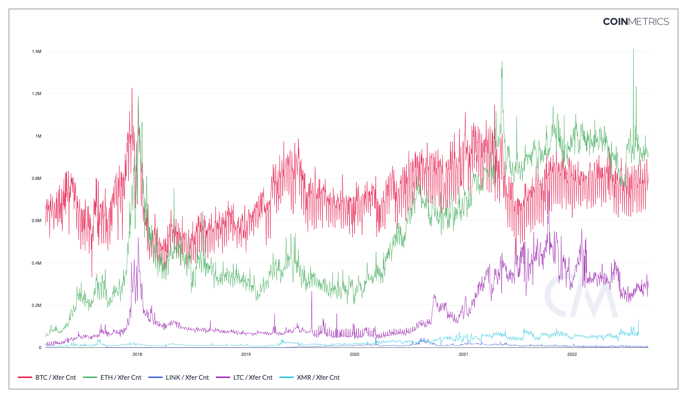

# Xfer Cnt

## Definition

The sum count of transfers that interval.

| Name     | MetricID | Category     | Subcategory | Type | Unit      | Interval |
| -------- | -------- | ------------ | ----------- | ---- | --------- | -------- |
| Xfer Cnt | TxTfrCnt | Transactions | Transfers   | Sum  | Transfers | 1 day    |

## Details

* A transaction is comprised of one or more transfers between different entities. A single transaction may contain dozens of distinct transfers, which represent the movements of native units from one ledger entity to another distinct ledger entity. Only transfers that have a positive (non-zero) value are counted. Transfers have been colloquially referred to as "payments".
* For ETH, we do not count failed transactions or self-sends towards TxTfrCnt. We do count internal transfers and do not distinguish them from top-level transfers. One way to think of TxTfrCnt is to count each time ETH effectively changes hands (excluding payment of fees and new issuance)

## Chart

<figure><figcaption>
Source: CM Network Data Charts
</figcaption></figure>

## Examples

Consider a single Bitcoin transaction that represents a company's payroll. The company broadcasting this transaction spends one input and generates 12 UTXOs, one for each of its employees. In this example, that transaction would entail 12 transfers.

## Release History

* Release Version: NDP-EOD 1.0

## Availability for Assets


