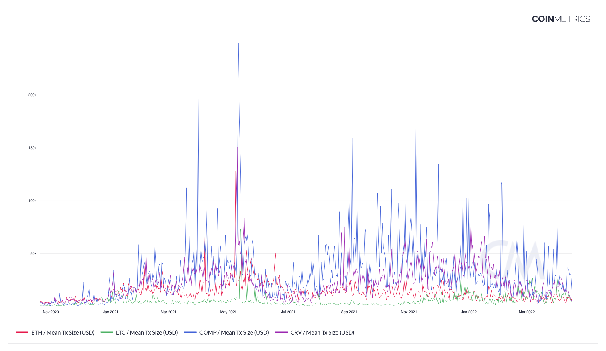

# Mean Tx Size (USD)

## Definition

The sum USD value of native units transferred divided by the count of transfers (i.e., the mean "size" in USD of a transfer) that interval.

| Name               | MetricID        | Category     | Subcategory    | Type | Unit | Interval      |
| ------------------ | --------------- | ------------ | -------------- | ---- | ---- | ------------- |
| Mean Tx Size (USD) | TxTfrValMeanUSD | Transactions | Transfer value | Mean | USD  | 1 day, 1 hour |

## Details

* Computed as TxTfrValMeanNtv \* PriceUSD

## Chart

<figure><figcaption>
Source: CM Network Data Charts
</figcaption></figure>

## Asset-Specific Details

* For assets that have opt-in privacy features, like ZCash, it only takes the non-private activity.

## Release History

* Released in the 1.0 release of NDP

## See Also

* [TxTfrValMeanNtv](https://docs.coinmetrics.io/asset-metrics/transactions/txtfrvalmeanntv#definition)
* [TxTfrValNtv](https://docs.coinmetrics.io/asset-metrics/transactions/txtfrvalntv#details)

## Availability for Assets


