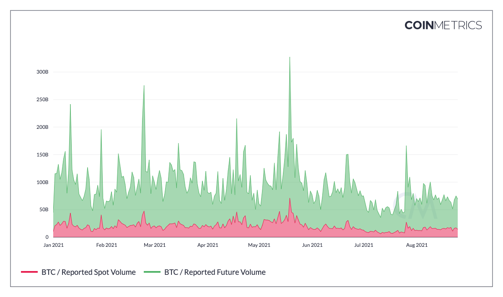

# Reported Spot Volume

## Definition

The sum of all reported volume from the spot markets in Coin Metrics' coverage in units of U.S. dollars.

| Name | MetricID | Category | Subcategory | Type | Unit | Interval |
| :--- | :--- | :--- | :--- | :--- | :--- | :--- |
| Reported Spot Volume | volume\_reported\_spot\_usd\_1d | Volume | Spot | NA | USD | 1d |
| Reported Spot Volume, 1 Hour | volume\_reported\_spot\_usd\_1h | Volume | Spot | NA | USD | 1h |

## Details

Our reported volume metric is an aggregation of the reported volume from all exchanges in CM's coverage universe.  Covered exchanges can be found [here](../../exchanges/all-exchanges.md).

## Chart

## Examples

A sample of the daily reported spot volume for Bitcoin is shown below:

| assets | time | volume\_reported\_spot\_usd\_1d |
| :--- | :--- | :--- |
| btc | 2021-07-25 00:00:00 | 7790004055.86305 |
| btc | 2021-07-26 00:00:00 | 27380811113.0087 |
| btc | 2021-07-27 00:00:00 | 16167140594.9998 |
| btc | 2021-07-28 00:00:00 | 19318207388.4525 |

* asset. The IDs of the asset.
* time. The reference rate time in ISO 8601 date-time format.
* reported\_trusted\_spot\_usd\_1d. The reported volume value in units of U.S. dollars.

## Release History

* Release Version. Market Data Feed 2.4 \(August 2021\) 

## See Also

* [Trusted Volume](volume_trusted_spot_usd_1d.md)
* [Reported Future Volume](volume_reported_future_usd_1d.md)
* [Reported Coin-Margined Future Volume](volume_reported_future_coin_margined_usd_1d.md)
* [Reported Non-Perpetual Future Volume](volume_reported_future_nonperpetual_usd_1d.md)
* [Reported Perpetual Future Volume](volume_reported_future_perpetual_usd_1d.md)
* [Reported Tether-Margined Future Volume](volume_reported_future_tether_margined_usd_1d.md)

## Availability for Assets



