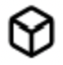

# Atlas Explorer User Interface

## Searching: First Select an Asset

Click on the button to the left of the search field and select an asset from the drop down menu.

Please note an orange "beaker" symbol to the right side of certain cryptoassets indicates that the particular cryptoasset is experimental and should be used with caution.

## Searching Blocks

To search for a block, enter the block hash or block height after selecting the appropriate asset chain. Click the Search button to return results.

The Search Results page will return the block and transactions applicable to that Block.&#x20;

You can filter your Search Results by "Type" to see just the Block or just the Transactions.

The Search Results can also be downloaded for review by clicking the Download button to the right side of the screen from Search Results.

Clicking on the Block will bring you to the Block Detail page.  Clicking on a transaction will bring you to the Transaction Detail page.

The Block Detail page contains summary metrics attributed to the Block as well as all the Transactions applicable to the Block

The top portion of the page has summary metrics for the block.&#x20;

* Transfer Value:  The total amount transferred (sent) by all transactions in the block.  The amount transferred is shown in both the native value of the coin and the current USD value.&#x20;
* Number of Transactions:  Total number of transactions in the block.
* Balance Updates:  Number of changes to the balance of an account/address as a result of the transactions in the block. &#x20;
* Total Fees:  Sum of all fees paid within the block.
* Mean Fee:  Average fee paid for a transaction within the block.
* New Coin Issuance:  Reward issued to the miner/validator who produced the block.
* Block Size: Total size in bytes of all transactions included in the block.
* Block Virtual Size: A block weight/size measurement (for SegWit transactions) with one vsize/vbyte being equal to four weight units.
* Reported Time:  Timestamp put in the block header by the miner/validator.
* Normalized Time:  Timestamp that provides accurate ordering - i.e., it is always greater than or equal to the parent timestamp.

.png>)

The bottom portion of the page will display the Transactions for the given Block. Included here is high-level information for each transaction, like the amount of cryptoasset transferred for the given transaction (in native value and current USD value) and the fee for the transaction (in native value and current USD value).  To download all the transactions for the block into a csv file, click the Download button.  To sort transactions by one of the column headings, click the heading name.

For detailed transaction information, click the Transaction Hash hyperlink.  This will bring you to the Transactions Details page.&#x20;

The block height details on the right side of the screen show the applicable block height number as well as the Reported Time (Miner/Validator timestamp). The Parent Block can be navigated to by clicking the down arrow icon (or clicking on the Parent Hash hyperlink). The Child Block can be navigated to by clicking the up arrow icon. The Chain Tip can be navigated to by clicking the endpoint icon.

## **Searching Addresses/Accounts**

To search for an address/account, enter the address after selecting the appropriate asset chain. Click the Search button to return results.

The search will bring back the Address if it exists. High level information such as the current balance will be displayed amongst other data points. To get further details on the Address, click on the result to go to the Address Details page.

The Address Details page will display summary metrics for the address, balance updates, and a balance overtime graph.

The summary metrics for the address includes the following:

* Balance: Sum total value for this address/account (in both native units and current USD value).
* Number of Debits/Credits:  Number of times this account/address has been debited and credited (i.e., number of balance updates).
* Creation Height: Number of confirmed blocks in the blockchain at the creation of account/address.
* Last Credit Height: Number of confirmed blocks in the blockchain at the last credit for account/address.
* Total Received: Sum total this account/address has been credited (in both native units and current USD value).
* Total Sent: Sum total this account/address has debited (in both native units and current USD value).
* Creation Time: Time at creation of account.
* First Received: Time of first credit.
* First Sent: Time of first debit.
* Last Received: Time of last credit.
* Last Sent: Time of last debit.

The lower half of the Address Details shows the Balance Updates.  The Balance Updates are each debit and credit to the account/address (note: a transaction may have more than one balance update, so you may see the same transaction hash for more than one balance update). This section is essentially the book of record for the address/account, displaying information attributed to each transaction in a double-entry bookkeeping format. &#x20;

All the Balance Updates for the Address can also be downloaded into a csv file by clicking the Download button.  To sort balance updates by one of the column headings, click the heading name.

For further information on the Transaction containing the balance update, click on the Transaction Hash hyperlink, which will bring you to the Transaction Details page.

The Balance Over Time on the right hand side is a graph depicting the amount of the native cryptoasset (blue line) in the address/account at the point in time on the horizontal axis.  The account/address amount is also shown in USD price (the orange line) at the given time.  &#x20;

.png>)

For navigation within the graph you can do the below with the icons in the top right of the chart**.**

* Zoom to a specific time range with the Magnifying Glass icon
* Zoom in with the + icon
* Zoom out with the - icon
* To navigate left or right while zoomed in click the Pan Direction icon
* To restore the original scaling, click the autoscale button

## **Searching Transactions**

To search for a transaction, enter the transaction hash after selecting the appropriate asset chain. Click the Search button to return results.

The search will bring back the Transaction if it exists.  Clicking on the Transaction will bring you to the Transactions Detail page. The results can also be downloaded by clicking the Download button.

The Transaction Details page is going to display summary metrics, balance updates, and block height details.

The summary metrics for the transaction includes:

* Amount Transacted:  Sum total in native units and current value USD of the amount transferred as part of this transaction
* Balance Updates:  Number of individual account debits and credits as part of this transaction.
* Block Hash: Hash of the block (unique per block) containing the transaction.
* Parent Hash: Hash of the parent block - i.e., the block at the previous height.
* Normalized Time:  Time of the transaction.  This "normalized" timestamp provides accurate ordering - i.e., it is always greater than or equal to the parent block timestamp.

For further details on the transaction Block or its Parent, click on the Block Hash hyperlink which will bring you to the Block Details page.

The Balance Updates section shows all the debits/credits to/from addresses/accounts for the given Transaction. Fees are All the debits/credits can be downloaded into a csv file by clicking the Download button.&#x20;

For further information on the Addresses click on the Address Hash hyperlink which will bring you to the Address Details page.

The Block Height detail shows the details (fees, confor the block containing the transaction. The Parent Block can be navigated to by clicking the down arrow icon. The Child Block can be navigated to by clicking the up arrow icon. The Chain Tip can be navigated to by clicking the endpoint icon.

## Icon Glossary

| Item                      | Applicable Icon                                                        |
| ------------------------- | ---------------------------------------------------------------------- |
| Block                     |        |
| Address                   |     |
| Transaction               |  |
| Info/Tool Tip             |         |
| Experimental Crypto Asset |         |
| Download                  |     |
