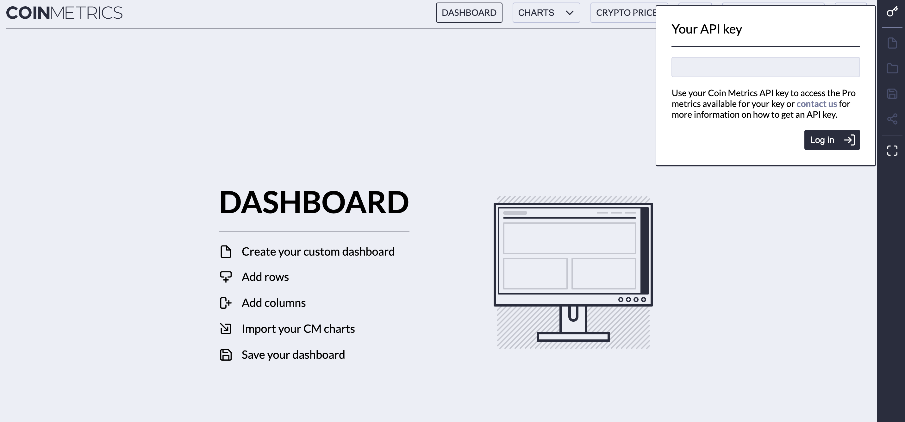
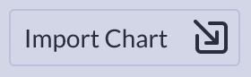
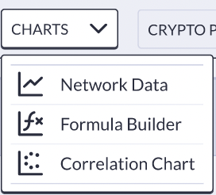
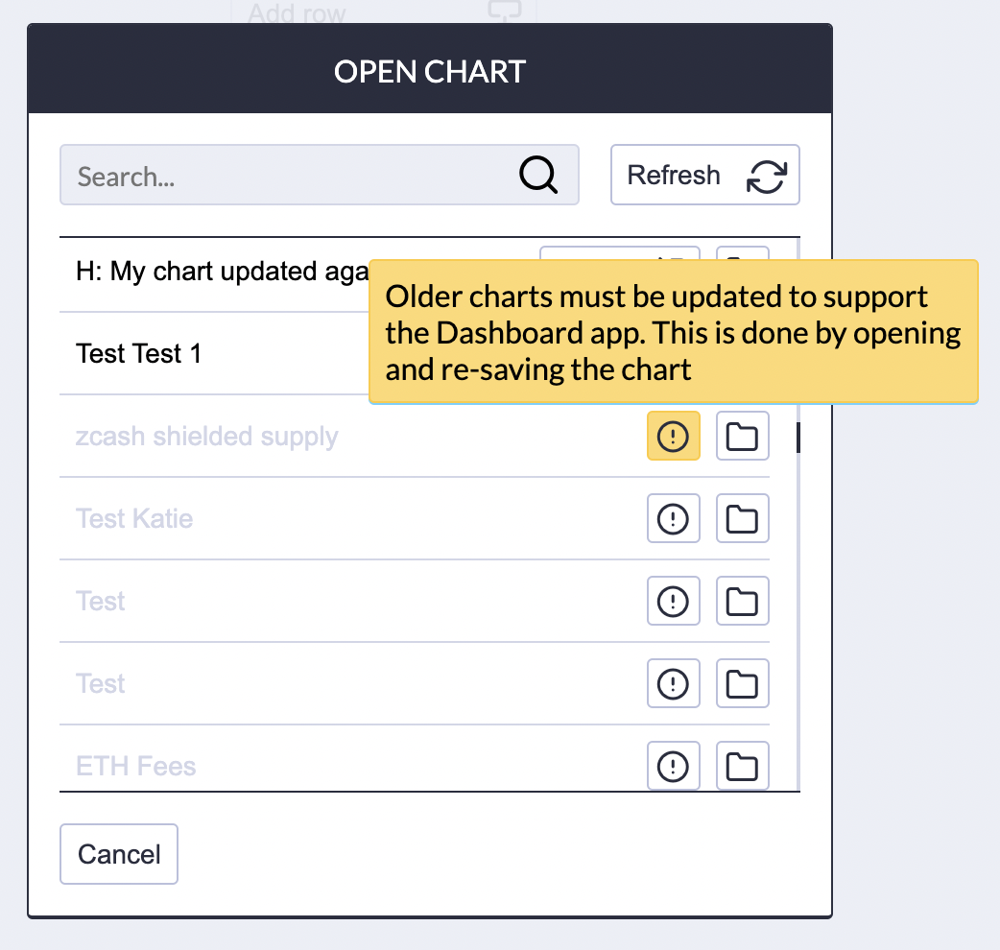
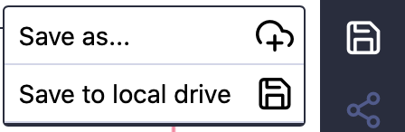
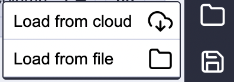

# Dashboard

The Dashboard enables you to organize and quickly view your saved charts \(from our [Data Visualization](../data-visualization/) suite\).  You can create a thematic dashboard \(e.g., a Mining Dashboard\), an asset-specific dashboard \(e.g., Favorite BTC charts\) or really any mashup that you'd like.  

When you arrive at our Dashboard home page, you will be prompted for your API key in the top right corner \(we will soon allow our community users to load the charts they've saved locally\).  **Note:  This tool does require that you have previously created and saved charts.**

## Creating a Dashboard

Upon entering your key, you will be directed to a blank dashboard. To create your personalized dashboard, simply click the "Import Chart" button to add one of your pre-saved charts.  

If you do not have any saved charts, simply return to the Network Data Charts, Formula Builder or Correlation Chart and start making and saving some charts.

Also, if you created your chart prior to July 2021, you will need to "re-save" them to enable our dashboard features.  You will see older charts _greyed out_ in the list of charts when importing \(see Chart \#2 below\).  

Use the "open" feature \(the file\) to easily navigate to the chart itself, re-save and return to the import chart dialog.

## Saving Dashboards

You can save your Dashboard by selecting the "save" image on the right toolbar.   There are two options for saving your dashboard:

* Save as... \(only available to users with a Viz API key\) - save your dashboard to your API key and reload it later from any device.  Dashboards saved to your API key can be "named" \(given a title\) and can be shared via a dashboard-specific URL.
* Save to local drive - save your dashboard to your local drive in a json format and reload it for later use.

## Loading Dashboards

To load a previously saved dashboard, select the "folder" image on the right toolbar.   If you saved your dashboard to your API key \(to the Cloud\), then "Load from cloud".  If you saved your dashboard to your local drive, then "Load from file". 

If you "Load from file", then find your file/dashboard using the explorer window.

