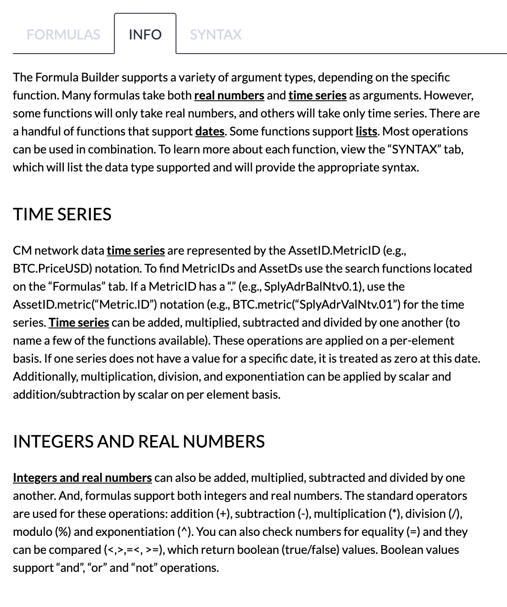
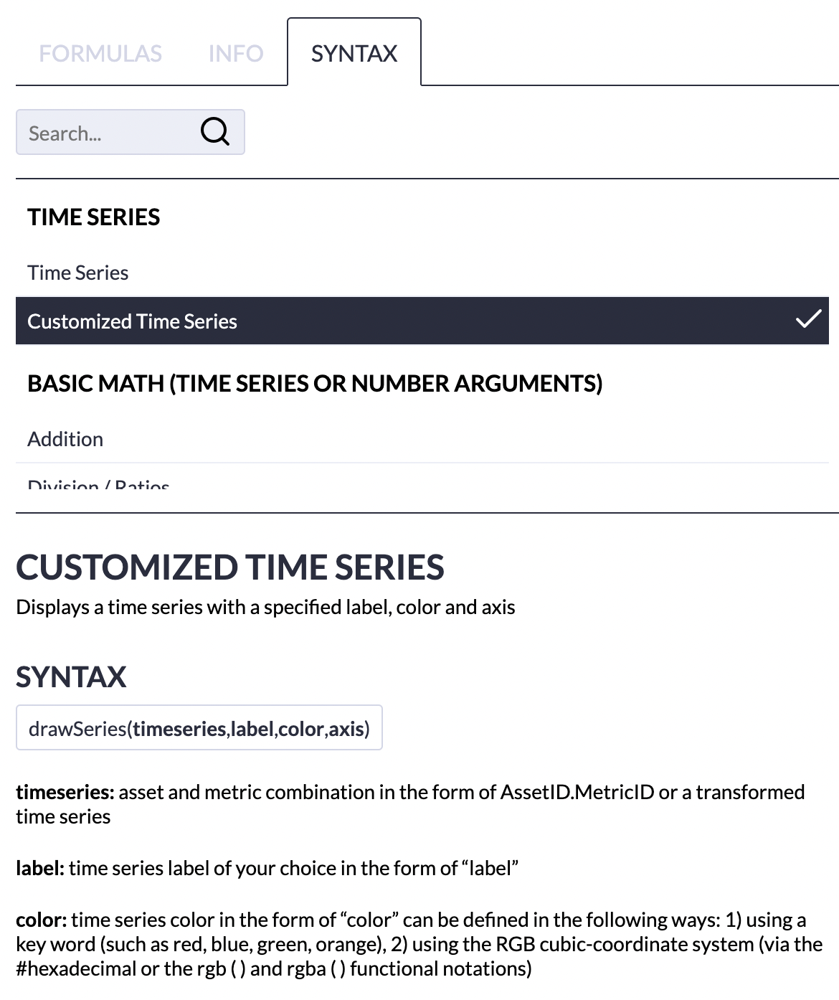
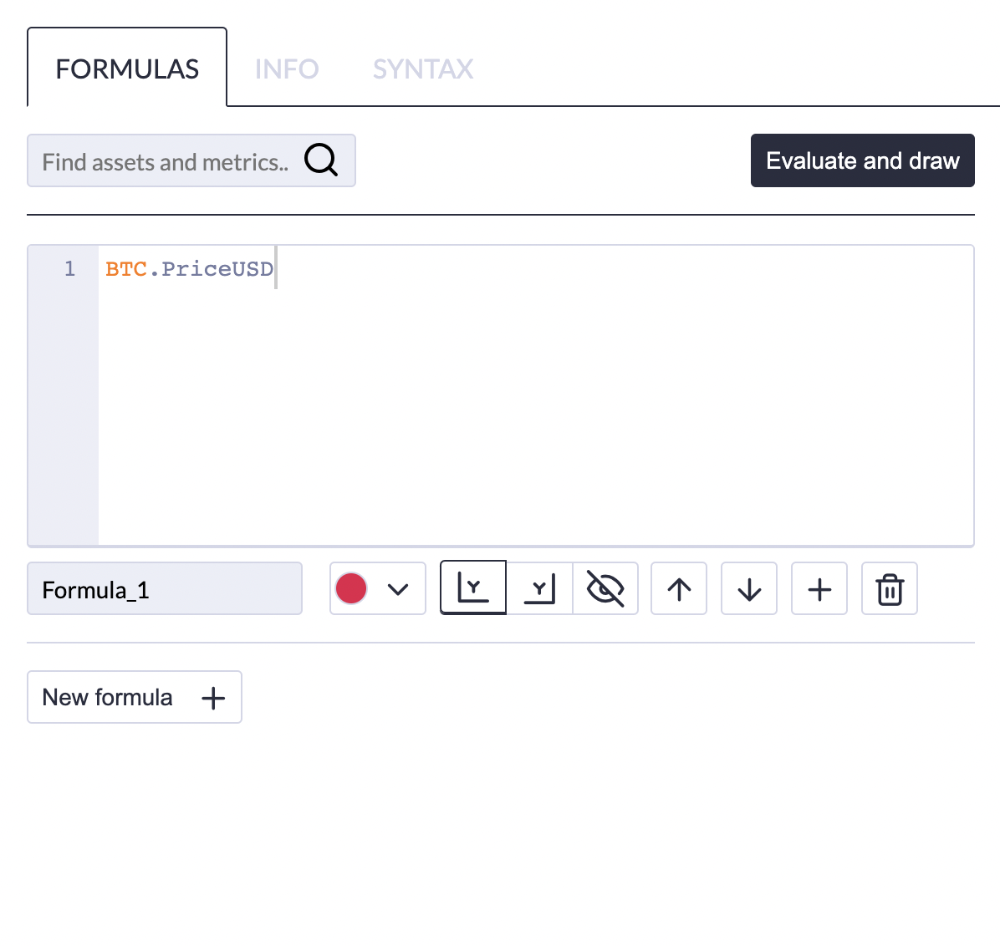

# Formula Builder

The formula builder allows you to transform the available Coin Metrics' data series.  For example, you can create your own ratios, add together USDT metrics, slice or splice time series, even customize the line colors and many more things.

The formula builder editor and information can be found via the right toolbar by clicking on the "formula button".

If you are unfamiliar with the formula builder and syntax, the "Information" tab is a good place to start.

Specific **syntax** and **examples** can be found on the "Syntax" tab.  You can search for the specific "formula" in the "Search..." window or scroll through the list of available formulas.  Once a formula is selected, further information on that formula \(including the "syntax" and often an example\) will be available in the lower window.

The formula editor is under the "Formula" tab.  An example of a very simple formula is shown below. 

