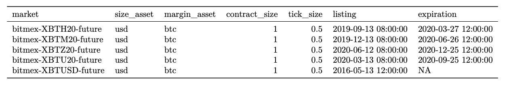

# Futures Contract Specifications

## **Definition**

Futures contracts can be described by their contract specifications which describe the underlying asset, how it is quoted, the date of expiration, the size of the contract, and other specifications necessary for market participants to enter into the contract. 

<table>
  <thead>
    <tr>
      <th style="text-align:left"><b>Name</b>
      </th>
      <th style="text-align:left"><b>Category</b>
      </th>
      <th style="text-align:left"><b>Subcategory</b>
      </th>
      <th style="text-align:left"><b>Type</b>
      </th>
      <th style="text-align:left"><b>Unit</b>
      </th>
      <th style="text-align:left"><b>Interval</b>
      </th>
    </tr>
  </thead>
  <tbody>
    <tr>
      <td style="text-align:left">Futures contract specifications</td>
      <td style="text-align:left">Market</td>
      <td style="text-align:left">Futures contract specs</td>
      <td style="text-align:left">Market data</td>
      <td style="text-align:left">
        
Price: quote asset

        
Size: Units of base asset

      </td>
      <td style="text-align:left">n/a</td>
    </tr>
  </tbody>
</table>

## Details

* A derivatives market represents a venue where contracts of a financial derivative are bought and sold.  Instead of an exchange rate, the price of a derivative represents the price of one contract.  Each financial derivatives contract has unique contract specifications which describe how the contract is quoted and the amount of notional exposure that a contract represents.  
* A futures contract is a financial derivative traded on an exchange that allows a buyer and seller to enter into a legal agreement to buy or sell an underlying asset. The term futures contract refers to both traditional futures contracts, which specify a defined time when the futures contract expires, and perpetual futures which simulate a traditional futures contract with the exception that it never expires.
* Each futures contract traded with the same symbol on a specified exchange are standardized, however, differences between contracts on the same exchange and between contracts on different exchanges exist. 

## **Example**

A sample of the futures contract specification data from BitMEX is shown below. 

* market:  The IDs of the market.  Market IDs use the following naming convention:  exchangeName-futuresSymbol-future for futures markets. 
* type: The type of the market. Can take values spot or future.
* min\_time:  Minimal available time for data from this market in ISO 8601 date-time format.
* max\_time:  Maximal available time for data from this market in ISO 8601 date-time format.
* base:  The contract’s underlying asset.
* quote:  The asset that the contract’s underlying asset is quoted in.
* symbol: The exchange-reported contract symbol.
* size\_asset: The asset that the contract’s size is denominated in.
* margin\_asset:  The name of the asset that the contract’s margin is denominated in.
* contract\_size:   The number of units of size\_asset that one contract represents. 
* tick\_size:  The minimum price increment of the contract’s price.
* listing:  The timestamp that the contract first became available for trading
* expiration:  The timestamp that the contract expires; equals null if the contract is a perpetual future that never expires.

## Release History

* Release Version: MDF v2.2 \(December 7, 2020\) - initial version

## **Availability**

Futures contract specs are available through our community API.  Community data is available via HTTP API only and is limited to 1,000 API requests per 10 minutes per IP address. 

For a full list of assets, exchanges, and markets, please consult the Coin Metrics Data Coverage file or the ‘/catalog-all/markets’ via the API.

### Markets

| Type | Number of Markets |
| :--- | :---: |
| Futures | 5645 |

### Exchanges

| Exchange | \# of Futures Markets | Start Date |
| :--- | :---: | :---: |
| Binance | 101 | 2019-09-08 |
| Bitfinex | 15 | 2019-07-03 |
| Bitflyer | 22 | 2020-07-27 |
| BitMEX | 226 | 2014-11-22 |
| Deribit | 54 | 2017-01-06 |
| FTX | 487 | 2019-03-05 |
| Huobi | 1236 | 2020-06-12 |
| Kraken | 29 | 2020-09-06 |
| OKEx | 778 | 2019-12-25 |

