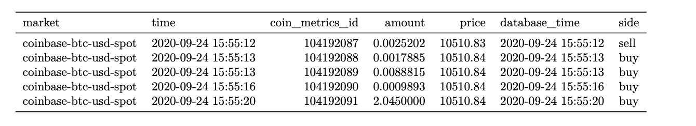

# Market Funding Rates

## **Definition**

Funding rates are a mechanism that exchanges use to ensure that perpetual futures trade at a price that is close to the price of the underlying spot markets. For the perpetual futures in our coverage universe, we offer realized funding rates. 

| **Name** | **Category** | **Subcategory** | **Type** | **Unit** | **Interval** |
| :--- | :--- | :--- | :--- | :--- | :--- |
| Futures funding rates | Market | Funding rate | Market data | Rate | Funding interval |

## **Details**

Traditional futures contracts expire at a specified date in the future. At expiration, traditional futures contracts will settle at a price based on the futures contract underlying’s spot price. This causes the futures contract’s price to converge to the underlying’s spot price at expiration. Perpetual futures contracts are similar to traditional futures contracts except that they never expire. To ensure that the perpetual futures contracts trade a price that is close to the underlying’s spot price, exchanges created a mechanism called the funding rate. Under this mechanism, there are periodic funding payments between long position holders and short position holders depending on whether the perpetual future’s price is higher or lower than the underlying’s spot price. While the formula for how the funding rate is calculated varies by exchange, the general principle is that the funding rate is positive if the perpetual futures’s price is higher than the underlying’s spot price and negative if the perpetual futures’s price is lower than the underlying’s spot price. If the funding rate is positive, long position holders will pay the funding payment to short position holders. If the funding rate is negative, short position holders will pay the funding payment to long position holders. Therefore, the funding rate mechanism encourages traders to take positions that keep perpetual futures’s prices in line with the underlying’s spot price.

### **Harmonization Discussion**

Exchanges differ in their funding rate mechanism design and how they report the data through their API. This section will discuss the key differences between exchanges and our approach to creating a harmonized data model.

* **Realized funding rate versus predicted funding rate:** Many exchanges report two different funding rates. The realized funding rate represents the actual funding rate calculated over the previous funding interval that is used in determining the funding payment. The predicted funding rate is the current estimate of what the funding rate will be at the end of the current funding interval. Some exchanges refer to this as the real-time funding rate or the next funding rate. While the predicted funding rate could be important to certain users, in this data concept we are concerned about the realized funding rate. Any references to the term “funding rate” in this document refer to the realized funding rate.
* **Funding rate period:** Interest rates represent the change over a defined period of time. Many interest rates we encounter in daily life are reported on an annualized basis \(a period of one year\) because it is a logical period of time. But exchanges can differ on the funding rate period that they use. For many exchanges, the funding rate represents an 8 hour interest rate, so the funding rate period is 8 hours, but not all exchanges report their funding rate with the same funding rate period. We store the funding rate period as a separate column described below. With this information, a user can compare funding rates between exchanges that have different funding rate periods by converting the funding rates to a common funding period.
* **Funding interval:** The funding interval represents how often the funding rate and funding payments are calculated. For many exchanges, a funding rate is produced every 8 hours and it is calculated based on the difference between the futures’s price and the spot’s price over the previous 8 hours. In this case, the funding interval is 8 hours. For some exchanges, the funding rate and funding payments are calculated on a continuous basis, so the funding interval is set to 1 millisecond by convention.
* **Exchange-reported timestamp:** Exchanges differ in the how they report the timestamp associated with funding rates. Many exchanges report the funding rate as a timeseries, that is, a series of data points with timestamps that are equally spaced through time. The timestamps represent the time when the funding rate and funding payments are calculated. Other exchanges report the funding rate as a snapshot in time \(similar to order book snapshots\) and the exchange-reported timestamp represents the timestamp of the query. This method of reporting the funding rate requires some transformation to convert it to a timeseries. Regardless of 16 how the exchanges report the timestamp, we store the funding rates as a timeseries, with one observation at the end of every funding interval.

## **Example**

* market: The id of the market. Market ids use the following naming convention: exchangeName-baseAsset-quoteAsset-spot for spot markets and exchangeName-futuresSymbol-future for futures markets.
* time: The time at which Coin Metrics queried the open interest data from an exchange in ISO 8601 date-time format.
* database\_time: The timestamp when the data was saved in the database in ISO 8601 date-time format with nanoseconds precision.
* rate: The funding rate expressed as a percentage over the period For example, if the funding rate is 0.10%, expressed as an 8 hour rate and calculated continuously, the rate is 0.0010.
* period: The periodicity of the funding rate. Using the above example, the period is 08:00:00.
* interval: The interval over which the funding rate is calculated. Using the above example, the interval is set to 00:00:00.001 or 1 millisecond to represent the continuous funding interval.

## Resource History

* Release Version: MDF v2.2 \(December 7, 2020\) - initial version

## **Availability**

### **Markets**

| Type | Number of Markets |
| :--- | :---: |
| Perpetual Futures | 350 |

