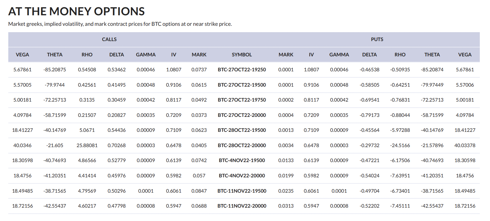

# Market Greeks

## **Definition**

Option greeks represent the sensitivity of the price of an options contract with respect to changes in its underlying parameters. Greeks are used in risk management and hedging so that market participants can achieve their desired exposure.

## **Details**

Exchanges report the following greeks:

* Vega: The first derivative of the option’s price to the volatility of the underlying asset’s price.
* Theta: The first derivative of the option’s price to the passage of time.
* Rho: The first derivative of the option’s price to the risk free interest rate.
* Delta: The first derivative of the option’s price to the underlying asset’s price.
* Gamma: The second derivative of the option’s price to the underlying asset’s price.

## Chart

<figure><figcaption><p>Source: CM <a href="https://coinmetrics.io/insights/state-of-the-market/">State of the Market</a></p></figcaption></figure>

## **Example**

A sample of the options greeks data from our [`/timeseries/market-greeks`](https://docs.coinmetrics.io/api/v4#operation/getTimeseriesMarketGreeks) API endpoint is shown below for the `deribit-ETH-25MAR22-1200-P-option` market.

```
{
  "data" : [ {
    "market" : "deribit-ETH-25MAR22-1200-P-option",
    "time" : "2021-09-01T13:24:00.000000000Z",
    "database_time" : "2021-09-01T13:24:41.266168000Z",
    "exchange_time" : "2021-09-01T13:24:00.000000000Z",
    "vega" : "2.47772",
    "theta" : "-0.70691",
    "rho" : "-1.31245",
    "delta" : "-0.04137",
    "gamma" : "0.00003"
  }, {
    "market" : "deribit-ETH-25MAR22-1200-P-option",
    "time" : "2021-09-01T13:25:00.000000000Z",
    "database_time" : "2021-09-01T13:25:48.270609000Z",
    "exchange_time" : "2021-09-01T13:25:00.000000000Z",
    "vega" : "2.48249",
    "theta" : "-0.70833",
    "rho" : "-1.31661",
    "delta" : "-0.04156",
    "gamma" : "0.00003"
  },
```


*   **`market`**:  The id of the market. Market ids use the following naming convention for options markets: `exchangeName-optionsSymbol-option`&#x20;


*   **`time`**: The time at which Coin Metrics queried the implied volatility data from an exchange in ISO 8601 date-time format. Always with nanoseconds precision.


*   **`database_time`**:  The timestamp when the data was saved in the database in ISO 8601 date-time format with nanoseconds precision. Always with nanoseconds precision.


*   **`exchange_time`**:  The timestamp reported by the exchange.  Can be null if the exchange does not report a timestamp.


*   **`vega`**: The first derivative of the option’s price to the volatility of the underlying asset’s price.


*   **`theta`**: The first derivative of the option’s price to the passage of time.


*   **`rho`**: The first derivative of the option’s price to the risk free interest rate.


*   **`delta`**: The first derivative of the option’s price to the underlying asset’s price.


* **`gamma`**: The second derivative of the option’s price to the underlying asset’s price.

## Release History

* [**CM MDF v2.5 on November 22, 2021**](https://coinmetrics.io/cm-market-data-feed-v2-5-release-notes/): We expanded our options coverage to include several new data types, including market implied volatility, from Deribit and added several new API endpoints to serve this data.
