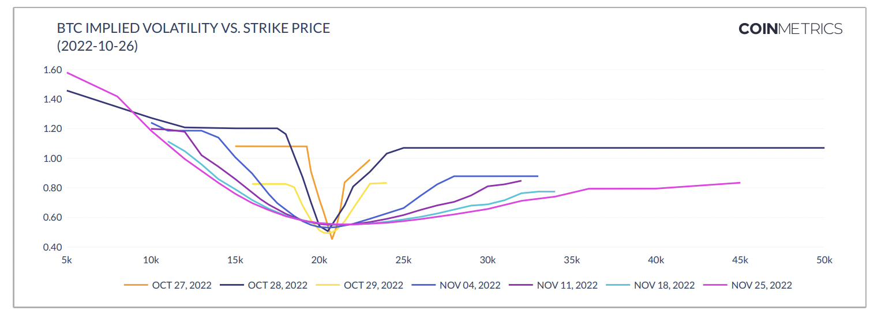

# Market Implied Volatility

## **Definition**

The implied volatility of an asset represents the market’s expectation of future volatility as derived from options prices, and is calculated using an options pricing model. When this value is input to an options pricing model, that makes the actual options price equal to its theoretical price.&#x20;

## **Details**

Options pricing models determine the theoretical price of an option contract as a function of several inputs. The Black-Scholes model, a widely used option pricing model, uses the following five inputs:

* Price of the underlying asset
* Strike price of the option
* Time until option expiration
* Risk-free interest rate
* Volatility of the price of the underlying asset

In other words:

_Option price = f(underlying price, strike price, time, interest rate, volatility)_

All the inputs, with the exception of volatility, are observable. The option price is also observable from market transactions. Suppose there is some inverse function _(_g = f-1) such that:

_volatility = g(option price, underlying price, strike price, time, interest rate)_

The volatility calculated from this equation is the implied volatility, or in other words, the market’s expectation of future volatility implied by option prices. By convention, implied volatility represents the standard deviation of returns of the underlying asset calculated on an annualized basis.

Trading in options markets is sparse and usually distributed over several hundred active options contracts. Since trades for a particular option contract can occur infrequently, the bid, ask, last and mark price of a particular option contract can vary significantly. To the extent possible, Coin Metrics reports the implied volatility derived from each of the various prices.&#x20;

## Chart

<figure><figcaption><p>Source: CM <a href="https://coinmetrics.io/insights/state-of-the-market/">State of the Market</a></p></figcaption></figure>

## **Example**

A sample of the options implied volatility data from our [`/timeseries/market-implied-volatility`](https://docs.coinmetrics.io/api/v4#operation/getTimeseriesMarketImpliedVolatility) API endpoint is shown below for the `deribit-ETH-25MAR22-1200-P-option` market.

```
{
  "data" : [ {
    "market" : "deribit-ETH-25MAR22-1200-P-option",
    "time" : "2021-09-01T13:24:00.000000000Z",
    "database_time" : "2021-09-01T13:24:41.266168000Z",
    "exchange_time" : "2021-09-01T13:24:00.000000000Z",
    "iv_bid" : "1.1869",
    "iv_ask" : "1.1492",
    "iv_mark" : "1.1685"
  }, {
    "market" : "deribit-ETH-25MAR22-1200-P-option",
    "time" : "2021-09-01T13:25:00.000000000Z",
    "database_time" : "2021-09-01T13:25:48.270609000Z",
    "exchange_time" : "2021-09-01T13:25:00.000000000Z",
    "iv_bid" : "1.1852",
    "iv_ask" : "1.1552",
    "iv_mark" : "1.1686"
  },
```

*   **`market`**:  The id of the market. Market ids use the following naming convention for options markets: `exchangeName-optionsSymbol-option`&#x20;


*   **`time`**: The time at which Coin Metrics queried the implied volatility data from an exchange in ISO 8601 date-time format. Always with nanoseconds precision.


*   **`database_time`**:  The timestamp when the data was saved in the database in ISO 8601 date-time format with nanoseconds precision. Always with nanoseconds precision.


*   **`exchange_time`**:  The timestamp reported by the exchange.  Can be null if the exchange does not report a timestamp.


*   **`iv_bid`**:  The implied volatility based on the last reported bid price


*   **`iv_ask`**:  The implied volatility based on the last reported ask price.


* **`iv_mark`**:  The implied volatility based on the last reported mark price

## Frequently Asked Questions

### **What can market implied volatility be used for?**&#x20;

Market participants use implied volatility in a variety of applications. Since implied volatility is a function of the option price (and other inputs), it often can be used as a replacement for price. Trading interfaces that show option chains typically show implied volatility alongside other critical information like the price, bid, ask, volume, and open interest. Some exchanges allow traders to input orders using implied volatility instead of price.

Implied volatility can also be used as a measure of valuation. Option prices can vary widely due to the range of inputs and are particularly sensitive to the strike price and time to expiration. The implied volatility allows options with different inputs to be compared against each other since it is derived from an options pricing model which incorporates the theoretical relationship between the other inputs and the options price. In theory, options contracts with the same underlying should have the same implied volatility. But market conditions and imbalances in supply and demand cause options to deviate from their theoretical value. Implied volatility is one measure market participants use to determine whether a particular options contract is under or overvalued.

Implied volatility also serves as the market’s expectation for future volatility and can be used to calculate the likelihood of future price movements in the underlying or to gauge market sentiment.

### **Why is the implied volatility for some Deribit options set to zero?**

Deribit sets the `iv_bid` to zero if there are no bids on the order book and sets the `iv_ask` to zero if there are no asks. This can happen for options with very low liquidity.

### **How is your implied volatility calculated?**

We currently report the exchange-reported implied volatility, so the figures are calculated using each exchange's proprietary option pricing model. In the future, we plan on developing our own option pricing model to calculate more implied volatility-related metrics.&#x20;

## Release History

* [**CM MDF v2.5 on November 22, 2021**](https://coinmetrics.io/cm-market-data-feed-v2-5-release-notes/): We expanded our options coverage to include several new data types, including market implied volatility, from Deribit and added several new API endpoints to serve this data.
