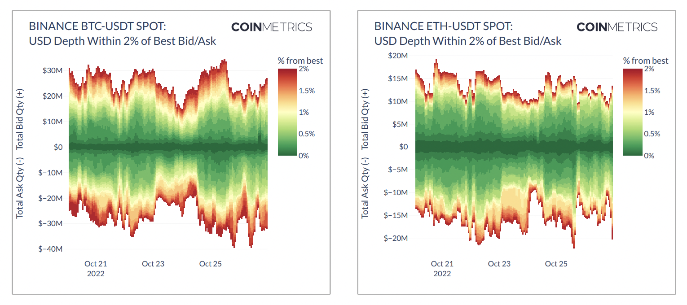

# Market Order Book

## **Definition**

An order book represents the list of buy orders and the list of sell orders for a given market organized by price level.  In this context, a buy order or sell order indicates the amount of the base asset that a buyer or seller wishes to trade for a spot market or the amount of contracts for a derivatives market.&#x20;

## Details

The price and amount that a trader is willing to buy is referred to as the bid. The price and amount that a trader is willing to sell is referred to as the ask. When a trade is executed between a buyer and a seller, an order is removed from the order book. While an order book is constantly updated in real-time as traders post new orders and as orders are matched, this data type represents a snapshot of the order book at a given moment in time.&#x20;

Coin Metrics stores three types of order book snapshots. One type consists of a snapshot of the top 100 bids and top 100 asks taken once every 10 seconds for major markets. The second type includes all levels where the price is within 10 percent of the midprice taken once every 10 seconds for major markets. The third type consists of a full order book snapshot (every bid and every ask) taken once every hour for all markets that we are collecting order book data for. All of these snapshots are served through our HTTP API endpoint [`/timeseries/market-orderbooks`](https://docs.coinmetrics.io/api/v4#operation/getTimeseriesMarketOrderbooks).

Coin Metrics also serves order book snapshots and updates for the top 100 bids and 100 asks for major markets through our websocket API endpoint [`/timeseries-stream/market-orderbooks`](https://docs.coinmetrics.io/api/v4#operation/getTimeseriesStreamMarketOrderbooks). The first message that the client receives is an order book snapshot. All subsequent messages are updates to the order book. This allows a user to maintain the current state of the order book at all times by storing the order book state locally and applying updates to it. &#x20;

## **Chart**

<figure><figcaption><p>Source: CM <a href="https://coinmetrics.io/insights/state-of-the-market/">State of the Market</a></p></figcaption></figure>

## **Example**

A sample of the order book snapshot data from the `coinbase-btc-usd-spot`market from our  [`/timeseries/market-orderbooks`](https://docs.coinmetrics.io/api/v4#operation/getTimeseriesMarketOrderbooks) API endpoint is provided below.&#x20;

```
{
  "data": [
    {
      "time": "2020-06-08T21:01:23.283083000Z",
      "market": "coinbase-btc-usd-spot",
      "coin_metrics_id": "1591479594286046-27268420",
      "asks": [
        {
          "price": "9701.48",
          "size": "2.65178241"
        },
        {
          "price": "9701.49",
          "size": "0.10941481"
        }
      ],
      "bids": [
        {
          "price": "9701.4",
          "size": "4.43779413"
        },
        {
          "price": "9699.94",
          "size": "0.041"
        }
      ]
    }
  ]
}
```

*   **`market`**:  The id of the market. Market ids use the following naming convention: `exchangeName-baseAsset-quoteAsset-spot` for spot markets, `exchangeName-futuresSymbol-future` for futures markets, and `exchangeName-optionsSymbol-option` for options markets.&#x20;


* **`time`**:  The exchange-reported time in ISO 8601 date-time format.\

* **`coin_metrics_id`**:   Unique identifier of the order snapshot.\

* **`price`**:  The price of the bid or ask on the order book in units of the quote currency.\

* **`size`**: The size of the bid or ask on the order book in units of the base asset for a spot market or number of contracts for a derivatives market.

## Frequently Asked Questions&#x20;

### **What are order book snapshots and order book updates?**&#x20;

An **order book snapshot** represents the state of the order book at a specific point in time. It contains the price level and amount for each bid and ask order in the order book.&#x20;

We store three types of order book snapshots. One type consists of a snapshot of the top 100 bids and top 100 asks taken once every 10 seconds for major markets. The second type includes all levels where the price is within 10 percent of the midprice taken once every 10 seconds for major markets. The third type consists of a full order book snapshot (every bid and every ask) taken once every hour for all markets.&#x20;

An **order book update** represents a single change to the state of the order book via an addition, change, or removal of a bid or ask order. Cryptocurrency exchanges typically report order book updates as a new  `[side, price, size]` tuple where the size represents the new value and not the delta from the previous value.&#x20;

We do not store historical data for order book updates yet, but we serve them in real-time via our websocket feed. By using a recent order book snapshot and applying all order book updates, a user can locally maintain the current state of the order book at all times.&#x20;

### **What is the difference between level 1, level 2, and level 3 order book data?**&#x20;

**Level 1** order book data refers to the top of the book, i.e. the price and amount of the best bid and the price and amount of the best ask. The level 1 data can be derived by extracting the best bid and best ask from our order book snapshots. We also serve this data through our [market quotes](https://docs.coinmetrics.io/market-data/market-quotes) API endpoint.&#x20;

**Level 2** order book refers to snapshots or updates where individual orders with identical price level are aggregated to one observation. The majority of cryptocurrency exchanges serve their order book snapshots and updates at level 2 resolution. Coin Metrics currently stores level 2 order book data. If an exchange reports order book data at level 3 resolution, we aggregate it to level 2 resolution before storing it.\
\
**Level 3** order book data refers to snapshots or updates where each individual order is present. Individual orders with identical price level are not aggregated. Only a small number of cryptocurrency exchanges serve their order book snapshots and updates at level 3 resolution.&#x20;

### **Do you offer order book updates in the form of new orders, cancels, and changes to existing orders?**

The majority of cryptocurrency exchanges do not report their order book updates with this information. Cryptocurrency exchanges typically report order book updates as a new  `[side, price, size]` tuple where the size represents the new value and not the delta from the previous value. However, some of this information can be derived by examining the change as a result of applying an order book update. If an update contains a tuple with a `size` of 0, this means that the order was matched with an incoming order (if at the top of the book) or canceled. If an update contains a tuple with `size` that is greater than the current size, this means that a new order was added to the order book or an existing order was changed. &#x20;

### **What is the latency of your order book data?**

The exact latency varies depending on the exchange, but our median latency is approximately 150 milliseconds. The 95th percentile latency is 300 milliseconds, and the 99th percentile latency is 400 milliseconds.&#x20;

### **Are your order book snapshots taken on exactly the second or hour?**&#x20;

Coin Metrics collects three different sized snapshots for order book data. One snapshot takes the top 100 bids and asks every 10 seconds for major markets. The second snapshot includes all levels where the price is within 10 percent of the midprice every 10 seconds for major markets. The third snapshot takes a a full order book snapshot for all markets that we are collecting order book data for once every hour. Although the value of `time` field always lies exactly on the second or hour, the actual time of the snapshot is close to but not exactly at this timestamp. We store the exact timestamp that a snapshot was taken and will expose this data through our API in a future release.&#x20;

### **How much order book history does Coin Metrics support?**

Generally, it is not possible to collect order book history from exchanges directly. Order book data is one of the data types that very few exchanges offer history for, with the exception of a very few like CME and some limited history from Binance. For this reason, our historical coverage begins at the time we started collecting it ourselves.&#x20;

### **Are there any limitations to the order book depth provided by each exchange?**

While we collect full order book depth for all exchanges that make it available, some exchanges only expose a limited number of levels.

| Exchange   | Available Depth |
| ---------- | --------------- |
| Binance    | Top 5000 levels |
| Binance.US | Top 5000 levels |
| bitFlyer   | Full book       |
| BitMEX     | Full book       |
| Bitstamp   | Full book       |
| Bittrex    | Top 500 levels  |
| Bybit      | Top 200 levels  |
| CEX.io     | Full book       |
| CME        | Full book       |
| Coinbase   | Full book       |
| Deribit    | Full book       |
| FTX        | Top 100 levels  |
| FTX.US     | Top 100 levels  |
| Gate.io    | Top 200 levels  |
| Gemini     | Full book       |
| Huobi      | Top 150 levels  |
| itbit      | Full book       |
| Kraken     | Top 500 levels  |
| Kucoin     | Full book       |
| Liquid     | Full book       |
| LMAX       | Top 20 levels   |
| OKX (OkEX) | Top 400 levels  |
| Poloniex   | Top 100 levels  |

## Release History

* **CM MDF v1.0 on April 2019:** Partial snapshots for major `btc-usd` and `eth-usd` markets. \

* **CM MDF v1.0 on July 30, 2019:** Added support for websocket endpoint which serves an initial snapshot and order book updates. \

* [**CM MDF v2.0 on December 9, 2019**](https://coinmetrics.io/release-of-cm-market-data-feed-version-2-0/)**:** Expanded coverage universe to include `cex.io-btc-usd` and  `bitflyer-btc-spot`.\

*   [**CM MDF v2.4 on September 1, 2021**](https://coinmetrics.io/cm-market-data-feed-v2-4-release-notes/)**:** Expanded both the depth of our order book snapshot coverage and our coverage universe. For important markets, we maintain a snapshot of the top 100 levels at 10 second intervals. Started storing full order book snapshots at hourly intervals. Expanded our coverage universe to additional markets on Coinbase, Binance, FTX, Bitfinex, itBit.&#x20;

    &#x20;
*   [**CM MDF v2.5 on November 22, 2021**](https://coinmetrics.io/cm-market-data-feed-v2-5-release-notes/)**:** Expanded our coverage universe to additional spot markets on Binance, Binance.US, Bitfinex, bitFlyer, Bitstamp, Bittrex, CEX.io, Coinbase, FTX, Gemini, Huobi, itBit, Kraken, Kucoin, Liquid, and LMAX. Initiated snapshot coverage of futures markets on Binance, Bitfinex, bitFlyer, BitMEX, Bybit, Deribit, FTX, Huobi, Kraken, OKEx. Initiated real-time coverage of CME order book snapshots.&#x20;

    &#x20;
*   [**CM MDF v2.6 on July 13, 2022**](https://coinmetrics.io/cm-market-data-feed-v2-6-release-notes/)**:** Added snapshot coverage of the top 100 bids and asks as well as full order book snapshots of OKEx spot markets, FTX.US spot markets, and CME futures markets. Added more frequent order book snapshots for several highly traded perpetual futures across many futures exchanges.&#x20;

    &#x20;
* [**CM MDF v2.7 on October 24, 2022**](https://coinmetrics.io/cm-market-data-feed-v2-7-release-notes/)**:** Expanded our coverage universe to additional spot and futures markets on Binance, Binance.US, Bitfinex, Bitflyer, BitMEX, Bitstamp, Bittrex, Bybit, CEX.io, Coinbase, CME, Deribit, FTX, FTX.US, Gemini, Huobi, Kraken, Kucoin, Liquid, OKEx. Expanded the depth of 10-second snapshots to include the maximum of 100 levels and all levels where the price is within 10 percent of the midprice.

## **Availability**

The previous 24 hours of order book data is available through our community API.  Community data is available via HTTP API only and is limited to 10 API requests per 6 seconds per IP address. All of our order book data is available through our professional API with higher rate limits. &#x20;

Our coverage universe is expanding rapidly. Please contact us at info@coinmetrics.io for the latest order book coverage.&#x20;
